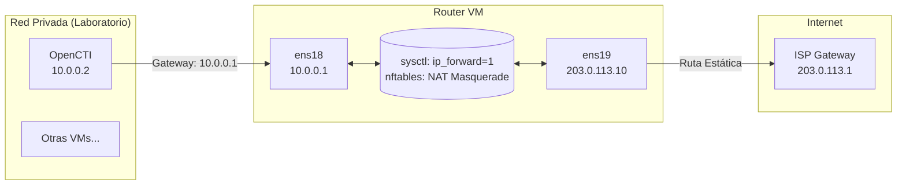

# Tabla de contenidos
1. [Propósito y contexto](#propósito-y-contexto)
2. [Creación VM Proxmox](#1-creación-vm-proxmox)
3. [Configuración de Red](#2-configuración-red)
    - [3.1 nftables – Reglas de NAT y Forwarding](#etcnftablesconf)
    - [3.2 Habilitar IP Forwarding (sysctl)](#etcsysctlconf)
    - [3.3 Configuración de Interfaces (Netplan)](#etcnetplan01-netcfgyaml)
    - [3.4 Verificación del Estado de Interfaces (ip addr)](#ip-addr-verificación-de-estado)
    - [3.5 Aplicación de la configuración](#aplicación-de-la-configuración)
    - [3.6 Verificación funcional del reenvío](#verificación-funcional-del-reenvío)
    - [3.7 Acceso administrativo y rol de bastión](#acceso-administrativo-y-rol-de-bastión)
4. [Diagrama de Enrutamiento y Forwarding](#diagrama-enrutamiento-y-forwarding)
   
---

# Propósito y contexto

Este anexo documenta la configuración técnica de la máquina virtual de enrutamiento utilizada durante la fase inicial del laboratorio, antes de la incorporación del firewall corporativo OPNsense. Su rol está descrito a alto nivel en el apartado 3.2.1.C (Implementación técnica y acceso a la red) de la memoria.

## Entorno de despliegue
- **Hipervisor:** Proxmox VE sobre servidor *bare metal* contratado en OVHcloud.
- **Sistema operativo de la VM:** Debian 12 (kernel Linux estándar).
- **Recursos asignados:** 1 vCore, 2 GB de RAM, 8 GB de disco.
- **Bridges de Proxmox:** 
	- `vmbr0` — interfaz externa, conectada a la WAN pública del servidor (mapeada a `ens19` dentro de la VM).
	- `vmbr1` — interfaz interna, conectada al segmento del laboratorio `10.0.0.0/24`

## Funciones que asume

- Enrutamiento entre el segmento privado (`10.0.0.0/24`) y la WAN pública.
- NAT (*masquerading*) para que las VMs internas accedan a Internet a través de la única IP pública disponible.
- Acceso administrativo mediante SSH (la VM funciona como *jump server* hacia el resto del laboratorio).
- Filtrado de tráfico de reenvío entre interfaces.

>[!WARNING]
> El uso de esta máquina está limitado a la fase inicial del despliegue, antes de la incorporación de OPNsense al laboratorio. Una vez OPNsense asume las funciones de enrutamiento, NAT y filtrado, esta VM de router temporal queda en desuso y se sustituye por aquel.
> 
## 1. Creación VM Proxmox


## 2. Configuración Red

### /etc/nftables.conf 

Este archivo configura las reglas de filtrado de paquetes mediante **nftables**, el sucesor moderno de `iptables`.

- **Propósito:** Permitir que las máquinas de tu red privada (10.0.0.x) salgan a internet usando la única IP pública que tienes en la interfaz externa.
    

**Explicación del código:**

- `flush ruleset`: Borra cualquier regla anterior para empezar limpio.
    
- **`table ip nat`:**
    
    - `chain postrouting`: Actúa cuando el paquete ya está saliendo de la VM.
        
    - `oif "ens19" masquerade`: **Esta es la línea más importante.** Significa "Todo lo que salga por la interfaz `ens19` (la WAN/Internet), enmascaralo con mi IP pública". Esto es el **NAT**. Sin esto, las máquinas internas enviarían paquetes con la IP 10.0.0.x a Google, y Google no sabría cómo responder.
        
- **`table ip filter` (El permiso de paso):**
    
    - `chain forward`: Controla el tráfico que _atraviesa_ la máquina (no el que va _a_ la máquina).
        
    - `iif "ens18" oif "ens19" accept`: Permite pasar el tráfico que entra por la LAN (`ens18`) y quiere salir por la WAN (`ens19`).
        
    - `ct state established,related accept`: Permite que la respuesta de internet (ej. la web que pediste) pueda volver a entrar hacia tu red privada.

```bash
flush ruleset

table ip nat {
  chain postrouting {
    type nat hook postrouting priority 100;
    oif "ens19" masquerade
  }
}

table ip filter {
  chain forward {
    type filter hook forward priority 0;
    ct state established,related accept
    iif "ens18" oif "ens19" accept
  }
}
```

### /etc/sysctl.conf  

Configuración de parámetros de Linux.

- `net.ipv4.ip_forward=1`:
    
    - **Explicación:** Por defecto, Linux es un "sistema final" (si recibe un paquete que no es para él, lo tira).
        
    - Al descomentar esta línea y ponerla en `1`, le dices al Kernel: **"Si recibes un paquete que no es para ti, reenvíalo a donde corresponda"**.
        
    - **Importancia:** Sin esto, aunque `nftables` esté bien configurado, el kernel bloquearía el tráfico antes de procesarlo. Es el conmutador a nivel de kernel que convierte un servidor en un router.

```bash
# Uncomment the next line to enable packet forwarding for IPv4
net.ipv4.ip_forward=1
```

### /etc/netplan/01-netcfg.yaml     

**Nota sobre las direcciones IP públicas mostradas:** Las direcciones públicas reales del servidor *bare metal* utilizado durante el desarrollo se han sustituido en toda la documentación por valores del rango `203.0.113.0/24`, reservado por el RFC 5737 para uso documental. La estructura, máscaras y configuración aplicadas son fieles al despliegue real.

Define las IPs estáticas y rutas de las tarjetas de red. 

- **`ens19` (WAN - Interfaz Externa):**
    
    - `addresses: [203.0.113.10]`: Tu IP pública. El `/32` indica que es una IP única, sin red alrededor.
        
    - `routes`: Configuración especial para proveedores de hosting. Como la máscara es `/32`, no hay puerta de enlace "en la misma red". La ruta dice: "Para llegar al Gateway `203.0.113.1`, lánzalo por la interfaz (`via: 0.0.0.0` y `scope: link`)".
        
    - `nameservers`: Usamos OpenDNS y Google (8.8.8.8) para resolver dominios.
        
- **`ens18` (LAN - Interfaz Interna):**
    
    - `addresses: [10.0.0.1/24]`: Esta es la IP privada de tu router.
        
    - **Importancia:** Esta IP (`10.0.0.1`) será la **Gateway** que hay que configurar en otras máquinas virtuales (como la de OpenCTI) para que tengan internet.

```yml
network:
  version: 2
  renderer: networkd
  ethernets:
    ens19:
      dhcp4: no
      dhcp6: no
      addresses: [203.0.113.10]
      gateway4: 203.0.113.1
      nameservers:
        addresses: [208.67.222.222,208.67.220.220,8.8.8.8]
      routes:
      - to: 145.239.16.254/32
        via: 0.0.0.0
        scope: link
    ens18:
      addresses: [10.0.0.1/24]

```

### ip addr (Verificación de estado)

Este comando muestra la realidad actual de las interfaces tras aplicar la configuración.

1. **`lo` (Loopback):** Interfaz interna del sistema (127.0.0.1). Todo correcto.
    
2. **`ens18` (LAN):**
    
    - Estado `UP`.
        
    - IP `10.0.0.1/24`.
        
    - Confirma que la red interna está lista para conectar otras VMs.
        
3. **`ens19` (Tu WAN):**
    
    - Estado `UP`.
        
    - IP `145.239.16.147/32`.
        
    - Confirma que tenemos conexión con el proveedor.

```bash
1: lo: <LOOPBACK,UP,LOWER_UP> mtu 65536 qdisc noqueue state UNKNOWN group default qlen 1000
    link/loopback 00:00:00:00:00:00 brd 00:00:00:00:00:00
    inet 127.0.0.1/8 scope host lo
       valid_lft forever preferred_lft forever
    inet6 ::1/128 scope host noprefixroute 
       valid_lft forever preferred_lft forever
2: ens18: <BROADCAST,MULTICAST,UP,LOWER_UP> mtu 1500 qdisc fq_codel state UP group default qlen 1000
    link/ether bc:24:11:5a:e5:27 brd ff:ff:ff:ff:ff:ff
    altname enp0s18
    inet 10.0.0.1/24 brd 10.0.0.255 scope global ens18
       valid_lft forever preferred_lft forever
    inet6 fe80::be24:11ff:fe5a:e527/64 scope link 
       valid_lft forever preferred_lft forever
3: ens19: <BROADCAST,MULTICAST,UP,LOWER_UP> mtu 1500 qdisc fq_codel state UP group default qlen 1000
    link/ether 02:00:00:6b:5a:13 brd ff:ff:ff:ff:ff:ff
    altname enp0s19
    inet 145.239.16.147/32 scope global ens19
       valid_lft forever preferred_lft forever
    inet6 fe80::ff:fe6b:5a13/64 scope link 
       valid_lft forever preferred_lft forever
```

### Aplicación de la configuración

Tras editar los ficheros descritos arriba, los cambios se aplican con los siguientes comandos:

```bash
# Aplicar configuración de red (netplan)
sudo netplan apply

# Aplicar parámetros del kernel (sysctl)
sudo sysctl -p

# Cargar reglas de nftables y habilitar el servicio para que persistan tras reinicio
sudo nft -f /etc/nftables.conf
sudo systemctl enable nftables.service
sudo systemctl start nftables.service
```

El servicio `nftables.service` carga automáticamente el fichero `/etc/nftables.conf` en cada arranque del sistema, garantizando que las reglas de NAT y *forwarding* se restablezcan sin intervención manual.
### Verificación funcional del reenvío

Además de comprobar el estado de las interfaces con `ip addr`, conviene validar que el enrutamiento opera correctamente desde una VM interna:

```bash
# Confirmar que el reenvío IPv4 está activo
cat /proc/sys/net/ipv4/ip_forward
# Salida esperada: 1

# Confirmar que las reglas de nftables están cargadas
sudo nft list ruleset

# Desde una VM interna, verificar conectividad saliente vía la VM router
ping -c 4 8.8.8.8
```

Si las tres comprobaciones devuelven el resultado esperado, la VM está actuando correctamente como *gateway* del segmento privado.
### Acceso administrativo y rol de bastión

La VM router conserva la configuración SSH por defecto de Debian 12, ya que su rol es transitorio y no expone servicios sensibles. Para acceder al resto de las VMs del segmento privado durante la fase de despliegue inicial, se utilizó el modo *jump server* nativo de OpenSSH:

```bash
# Acceso directo a una VM interna saltando por la VM router
ssh -J usuario@<IP_PUBLICA_ROUTER> usuario@10.0.0.X
```

Este patrón permitió administrar las VMs internas (que no disponían de IP pública propia) sin necesidad de instalar agentes adicionales ni abrir puertos en el firewall. Una vez incorporado OPNsense al laboratorio, esta función se sustituyó por el túnel WireGuard descrito en el anexo correspondiente.
## Diagrama enrutamiento y forwarding



