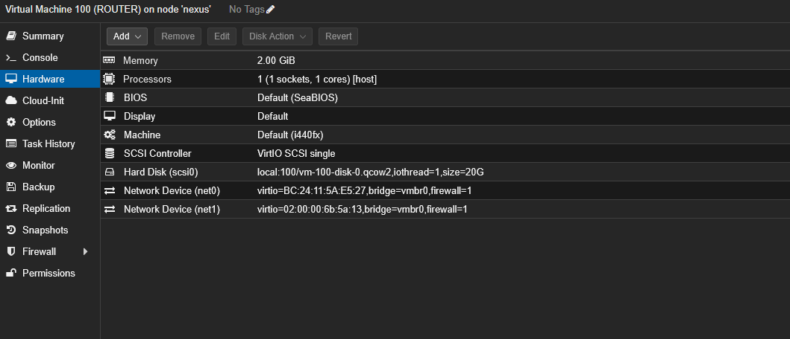
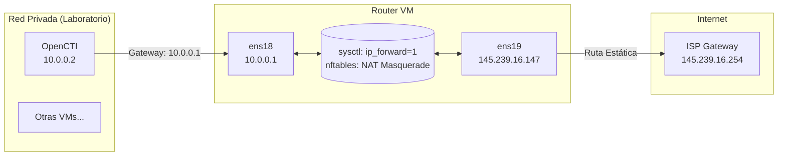

# Tabla de contenidos
1. [Creación VM Proxmox](#1-creación-vm-proxmox)
2. [Configuración de Red](#2-configuración-red)
    - [2.1 nftables – Reglas de NAT y Forwarding](#etcnftablesconf)
    - [2.2 Habilitar IP Forwarding (sysctl)](#etcsysctlconf)
    - [2.3 Configuración de Interfaces (Netplan)](#etcnetplan01-netcfgyaml)
    - [2.4 Verificación del Estado de Interfaces (ip addr)](#ip-addr-verificación-de-estado)
3. [Diagrama de Enrutamiento y Forwarding](#diagrama-enrutamiento-y-forwarding)
   
---
>[!INFO]
> El uso de esta maquina es exclusivamente para antes de tener OPNsense, cuando tengamos OPNsense dejara de ser util y sera sustituida por esta mencionada anteriormente 
> 
## 1. Creación VM Proxmox



## 2. Configuración Red

### /etc/nftables.conf 

Este archivo configura las reglas de filtrado de paquetes. Estás usando **nftables**, el sucesor moderno de `iptables`.

- **Propósito:** Permitir que las máquinas de tu red privada (10.0.0.x) salgan a internet usando la única IP pública que tienes en la interfaz externa.
    

**Explicación del código:**

- `flush ruleset`: Borra cualquier regla anterior para empezar limpio.
    
- **`table ip nat` (La magia del router):**
    
    - `chain postrouting`: Actúa cuando el paquete ya está saliendo de la VM.
        
    - `oif "ens19" masquerade`: **Esta es la línea más importante.** Significa "Todo lo que salga por la interfaz `ens19` (la WAN/Internet), enmascaralo con mi IP pública". Esto es el **NAT**. Sin esto, las máquinas internas enviarían paquetes con la IP 10.0.0.x a Google, y Google no sabría cómo responder.
        
- **`table ip filter` (El permiso de paso):**
    
    - `chain forward`: Controla el tráfico que _atraviesa_ la máquina (no el que va _a_ la máquina).
        
    - `iif "ens18" oif "ens19" accept`: Permite pasar el tráfico que entra por la LAN (`ens18`) y quiere salir por la WAN (`ens19`).
        
    - `ct state established,related accept`: Permite que la respuesta de internet (ej. la web que pediste) pueda volver a entrar hacia tu red privada.

```bash
flush ruleset

table ip nat {
  chain postrouting {
    type nat hook postrouting priority 100;
    oif "ens19" masquerade
  }
}

table ip filter {
  chain forward {
    type filter hook forward priority 0;
    ct state established,related accept
    iif "ens18" oif "ens19" accept
  }
}
```

### /etc/sysctl.conf  

Configuración de parámetros de Linux.

- `net.ipv4.ip_forward=1`:
    
    - **Explicación:** Por defecto, Linux es un "sistema final" (si recibe un paquete que no es para él, lo tira).
        
    - Al descomentar esta línea y ponerla en `1`, le dices al Kernel: **"Si recibes un paquete que no es para ti, reenvíalo a donde corresponda"**.
        
    - **Importancia:** Sin esto, aunque `nftables` esté bien configurado, el Kernel bloquearía el tráfico antes de procesarlo. Es el switch  para convertir un servidor en un router.

```bash
# Uncomment the next line to enable packet forwarding for IPv4
net.ipv4.ip_forward=1
```

### /etc/netplan/01-netcfg.yaml     

Define las IPs estáticas y rutas de las tarjetas de red. 

- **`ens19` (WAN - Interfaz Externa):**
    
    - `addresses: [145.239.16.147/32]`: Tu IP pública. El `/32` indica que es una IP única, sin red alrededor.
        
    - `routes`: Configuración especial para proveedores de hosting. Como la máscara es `/32`, no hay puerta de enlace "en la misma red". La ruta dice: "Para llegar al Gateway `145.239.16.254`, lánzalo por la interfaz (`via: 0.0.0.0` y `scope: link`)".
        
    - `nameservers`: Usamos OpenDNS y Google (8.8.8.8) para resolver dominios.
        
- **`ens18` (LAN - Interfaz Interna):**
    
    - `addresses: [10.0.0.1/24]`: Esta es la IP privada de tu router.
        
    - **Importancia:** Esta IP (`10.0.0.1`) será la **Gateway** que hay que configurar en otras máquinas virtuales (como la de OpenCTI) para que tengan internet.

```yml
network:
  version: 2
  renderer: networkd
  ethernets:
    ens19:
      dhcp4: no
      dhcp6: no
      addresses: [145.239.16.147/32]
      gateway4: 145.239.16.254
      nameservers:
        addresses: [208.67.222.222,208.67.220.220,8.8.8.8]
      routes:
      - to: 145.239.16.254/32
        via: 0.0.0.0
        scope: link
    ens18:
      addresses: [10.0.0.1/24]

```

### ip addr (Verificación de estado)

Este comando muestra la realidad actual de las interfaces tras aplicar la configuración.

1. **`lo` (Loopback):** Interfaz interna del sistema (127.0.0.1). Todo correcto.
    
2. **`ens18` (LAN):**
    
    - Estado `UP`.
        
    - IP `10.0.0.1/24`.
        
    - Confirma que la red interna está lista para conectar otras VMs.
        
3. **`ens19` (Tu WAN):**
    
    - Estado `UP`.
        
    - IP `145.239.16.147/32`.
        
    - Confirma que tenemos conexión con el proveedor.

```bash
1: lo: <LOOPBACK,UP,LOWER_UP> mtu 65536 qdisc noqueue state UNKNOWN group default qlen 1000
    link/loopback 00:00:00:00:00:00 brd 00:00:00:00:00:00
    inet 127.0.0.1/8 scope host lo
       valid_lft forever preferred_lft forever
    inet6 ::1/128 scope host noprefixroute 
       valid_lft forever preferred_lft forever
2: ens18: <BROADCAST,MULTICAST,UP,LOWER_UP> mtu 1500 qdisc fq_codel state UP group default qlen 1000
    link/ether bc:24:11:5a:e5:27 brd ff:ff:ff:ff:ff:ff
    altname enp0s18
    inet 10.0.0.1/24 brd 10.0.0.255 scope global ens18
       valid_lft forever preferred_lft forever
    inet6 fe80::be24:11ff:fe5a:e527/64 scope link 
       valid_lft forever preferred_lft forever
3: ens19: <BROADCAST,MULTICAST,UP,LOWER_UP> mtu 1500 qdisc fq_codel state UP group default qlen 1000
    link/ether 02:00:00:6b:5a:13 brd ff:ff:ff:ff:ff:ff
    altname enp0s19
    inet 145.239.16.147/32 scope global ens19
       valid_lft forever preferred_lft forever
    inet6 fe80::ff:fe6b:5a13/64 scope link 
       valid_lft forever preferred_lft forever
```

## Diagrama enrutamiento y forwarding



