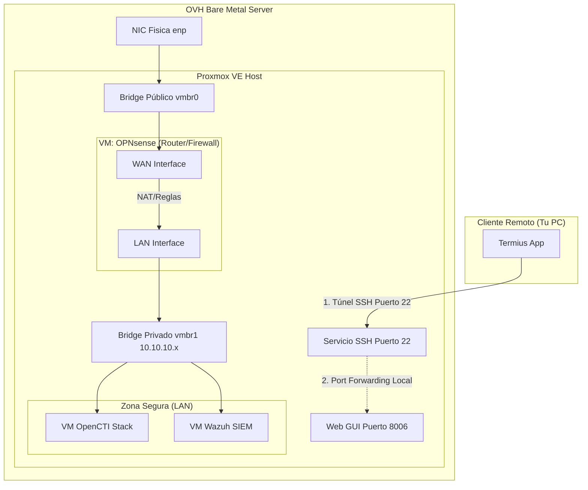

![[Pasted image 20251220200644.png]]
![[Pasted image 20251220200744.png]]
![[Pasted image 20251220200806.png]]
![[Pasted image 20251220200856.png]]

![[Pasted image 20260107184228.png]]
Routing forward  del router
![[WhatsApp Image 2026-01-07 at 18.54.53.jpeg]]

