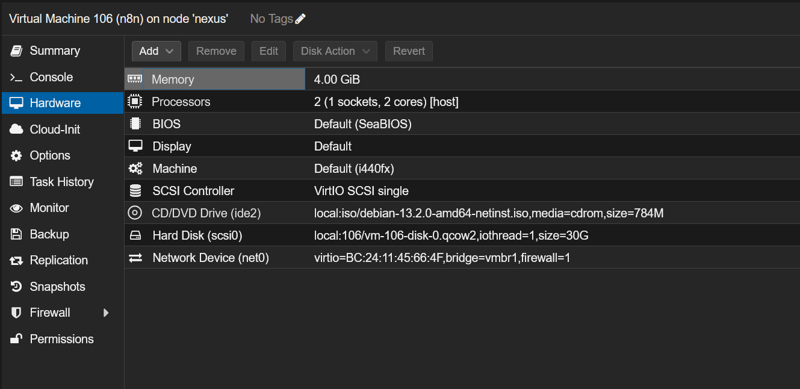

# Tabla de contenidos
1. [Creación VM Proxmox](#1-creación-vm-proxmox)
2. [Configuración de Red](#2-configuración-red)
    - [2.1 nftables – Reglas de NAT y Forwarding](#etcnftablesconf)
    - [2.2 Habilitar IP Forwarding (sysctl)](#etcsysctlconf)
    - [2.3 Configuración de Interfaces (Netplan)](#etcnetplan01-netcfgyaml)
    - [2.4 Verificación del Estado de Interfaces (ip addr)](#ip-addr-verificación-de-estado)
3. [Diagrama de Enrutamiento y Forwarding](#diagrama-enrutamiento-y-forwarding)
   
---
## 1. Creación VM Proxmox



## 2. Configuración Red


## 3. Preparación del Sistema Base

Lo primero siempre es asegurar que el sistema base está actualizado y cuenta con las dependencias esenciales para poder interactuar con repositorios externos y descargar paquetes.

```Bash
# Actualizar la lista de paquetes y el sistema
sudo apt update && sudo apt upgrade -y

# Instalar dependencias básicas
sudo apt install -y curl wget git nano apt-transport-https ca-certificates software-properties-common
```

## 4. Instalación de Docker y Docker Compose

La forma más limpia y robusta de instalar **Docker** en _Debian_ es utilizando su repositorio oficial. Este enfoque garantiza que recibiremos las últimas actualizaciones de seguridad.

```Bash

# Descargar e instalar la clave GPG oficial de Docker
sudo install -m 0755 -d /etc/apt/keyrings
sudo curl -fsSL [https://download.docker.com/linux/debian/gpg](https://download.docker.com/linux/debian/gpg) -o /etc/apt/keyrings/docker.asc
sudo chmod a+r /etc/apt/keyrings/docker.asc

# Añadir el repositorio a las fuentes de apt
echo \
  "deb [arch=$(dpkg --print-architecture) signed-by=/etc/apt/keyrings/docker.asc] [https://download.docker.com/linux/debian](https://download.docker.com/linux/debian) \
  $(. /etc/os-release && echo "$VERSION_CODENAME") stable" | \
  sudo tee /etc/apt/sources.list.d/docker.list > /dev/null

# Instalar Docker y sus plugins (incluido Docker Compose)
sudo apt update
sudo apt install -y docker-ce docker-ce-cli containerd.io docker-buildx-plugin docker-compose-plugin
```

## 5. Configuración del Entorno de n8n

n8n necesita un directorio local en el servidor para guardar los datos de forma persistente (flujos, credenciales, configuraciones). Por políticas de seguridad de la imagen, el contenedor se ejecuta con el usuario no privilegiado `node` (cuyo ID es `1000`).

```Bash
# Crear la carpeta principal para el proyecto (ej. en el home del usuario)
mkdir -p ~/n8n/n8n_data

# Cambiar los permisos para que el contenedor pueda escribir
# UID y GID 1000 corresponden al usuario 'node' dentro del contenedor
sudo chown -R 1000:1000 ~/n8n/n8n_data
```

## 5.1. Archivo `docker-compose.yml` y `.env`

Generamos el archivo de configuración para levantar el servicio utilizando la base de datos por defecto (SQLite):

```Bash
cd ~/n8n
nano docker-compose.yml
```

```yml

services:
  n8n:
    image: docker.n8n.io/n8nio/n8n:latest
    container_name: n8n_core
    restart: unless-stopped
    ports:
      - "${N8N_PORT}:5678"
    environment:
      - N8N_HOST=${N8N_HOST}
      - N8N_PORT=${N8N_PORT}
      - N8N_PROTOCOL=${N8N_PROTOCOL}
      - NODE_ENV=${NODE_ENV}
      - WEBHOOK_URL=${WEBHOOK_URL}
      - GENERIC_TIMEZONE=${GENERIC_TIMEZONE}
      - N8N_SECURE_COOKIE=false
      - N8N_RUNNERS_ENABLED=true
      - N8N_RUNNERS_MODE=internal
      - N8N_RUNNERS_AUTH_TOKEN=TokenParaMiTFG2026
    volumes:
      - ${DATA_FOLDER}:/home/node/.n8n
        
```

```env
# Configuración general
DATA_FOLDER=/opt/n8n/data
GENERIC_TIMEZONE=Europe/Madrid

# Configuración web
N8N_HOST=n8n.ryoiki
N8N_PORT=5678
N8N_PROTOCOL=http
WEBHOOK_URL=http://n8n.ryoiki:5678/

# Seguridad y entorno
NODE_ENV=production
```

## 6. Despliegue del Servicio y Comprobación

Una vez configurado el entorno, procedemos a descargar la imagen oficial y arrancar el contenedor en segundo plano (`-d` detached mode):

```Bash
# Levantar la infraestructura de n8n
sudo docker compose up -d

# Visualizar los logs en tiempo real para verificar un arranque sin errores
sudo docker compose logs -f
```