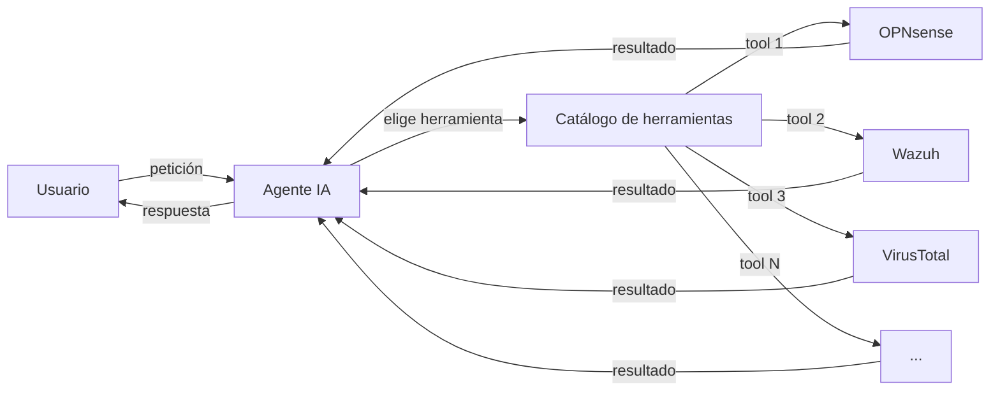
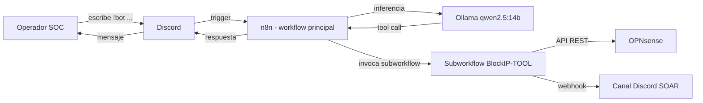
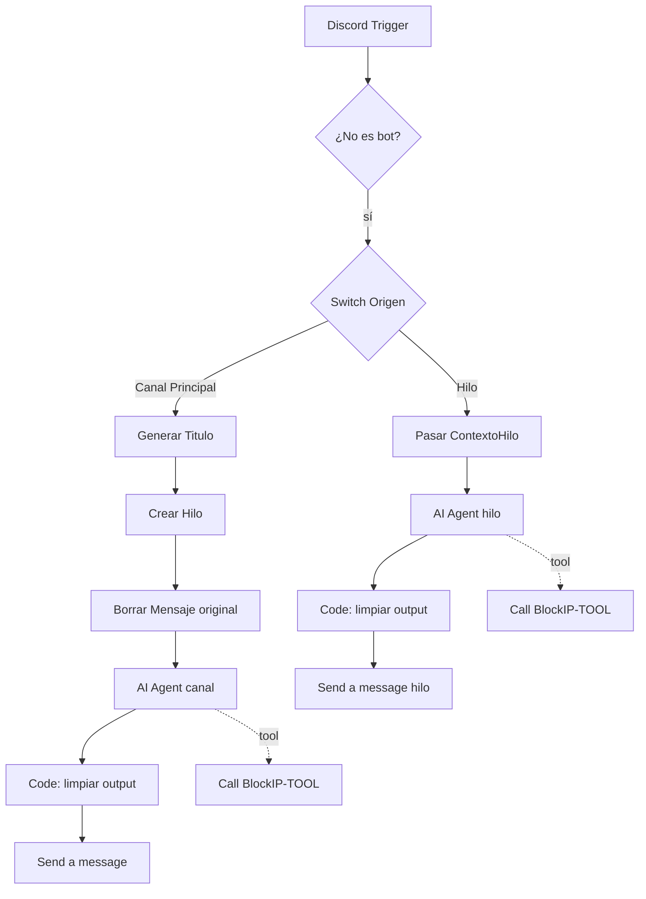
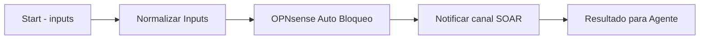
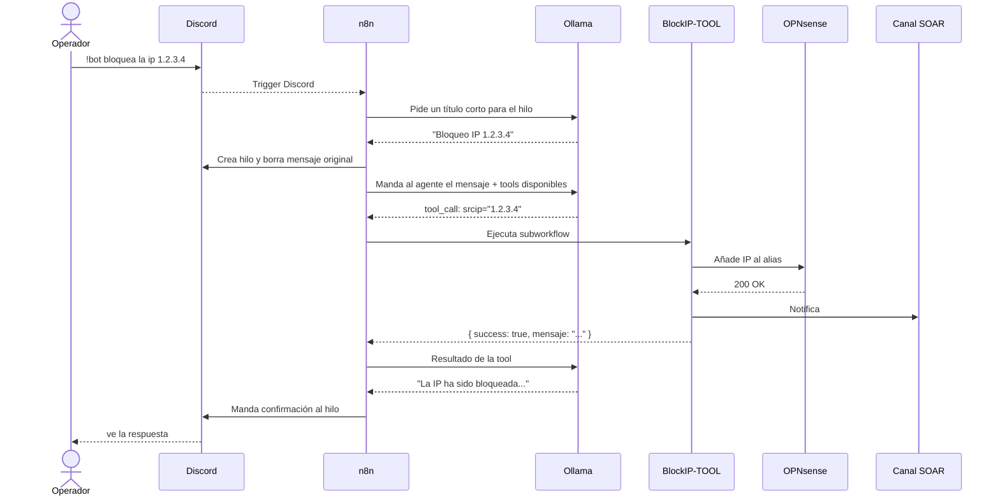
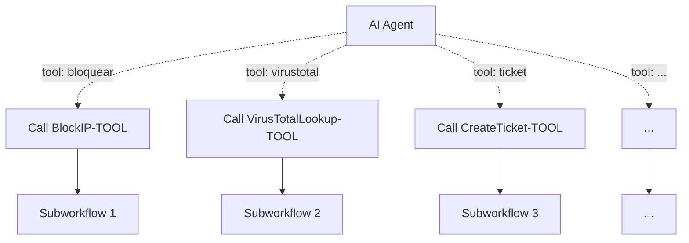

# Bot SOC en Discord con n8n y Ollama (PoC)

Documentación del workflow se desarrollo para el TFG. La idea principal **no es montar un bot que bloquee IPs** — eso es solo el caso de ejemplo. Lo que quiero demostrar es un **patrón de arquitectura** en el que un agente de IA local puede automatizar tareas sobre cualquier infraestructura, siempre que esa infraestructura tenga una API y sepamos exponerla como una "herramienta" para el agente.

El bloqueo de IPs en OPNsense lo he elegido porque es claro, fácil de comprobar (basta mirar la tabla del firewall) y porque en un SOC tiene sentido. Pero el mismo patrón sirve para cualquier acción operativa: reiniciar un servicio, abrir un ticket, consultar un endpoint, mandar un correo, lo que sea.

---

## 1. La idea de fondo

Cuando uno piensa en "automatizar con IA", lo primero que viene a la cabeza son chatbots: el usuario pregunta, el modelo responde texto. El paso interesante (y lo que demuestro aquí) es darle al modelo capacidad de **actuar**, no solo de hablar. El modelo deja de ser un loro que responde y pasa a ser un agente que puede llamar a sistemas reales.

Para eso hacen falta tres piezas:

1. **Un modelo capaz de hacer "tool calling"**: es decir, que sepa generar la llamada a una función con sus parámetros cuando lo necesita. Casi todos los LLM modernos lo soportan.
2. **Un orquestador que ejecute esas llamadas**: alguien que reciba la petición del modelo, ejecute la acción real, y le devuelva el resultado para que el modelo pueda contestar al usuario. Aquí uso n8n.
3. **Un catálogo de "herramientas"**: cada herramienta es básicamente un trozo de automatización que sabe hacer una cosa concreta sobre la infraestructura.

Lo bonito del patrón es que **una vez montada la infraestructura, añadir herramientas nuevas es relativamente barato**. Crear un subworkflow nuevo, exponerlo al agente con una descripción clara, y ya está disponible. El agente, leyendo solo la descripción, sabe cuándo usarla.



En el TFG implemento solo una herramienta para que el sistema sea demostrable, pero el diseño está pensado para escalar a muchas.

---

## 2. Qué hace el bot en concreto

Vive en un servidor de Discord. Cuando un operador escribe `!bot <lo que sea>`, el bot interpreta la petición y actúa:

- `!bot ¿qué es un ataque tipo SQL injection?` → responde como cualquier asistente.
- `!bot bloquea la ip 1.2.3.4` → llama al firewall y la bloquea de verdad, además de notificarlo en otro canal.
- (En el futuro) `!bot consulta esa IP en VirusTotal` → llamaría a otra herramienta. Etc.

La gracia es que **el agente decide solo** qué hacer en cada caso, leyendo el mensaje del usuario y mirando qué herramientas tiene disponibles. No hay reglas de tipo "if mensaje contiene 'bloquea' entonces…" en ningún sitio.

> **Captura `01_demo_canal_principal.png`**: una conversación de ejemplo en Discord con varias peticiones distintas (una pregunta general, un bloqueo manual, una petición ambigua) para que se vea cómo el bot decide en cada caso.

---

## 3. Arquitectura

### Diagrama general



### Componentes

- **n8n** (versión 2.9.4, self-hosted): el orquestador. Aloja tanto el workflow principal como los subworkflows-herramienta.
- **Ollama** corriendo en `10.10.10.2:11434`, sirviendo `qwen2.5:14b` (cuantización Q4_K_M). Es el LLM local. Lo importante de elegir un modelo local y no uno de OpenAI/Anthropic es que toda la información sensible que circula (IPs, alertas, datos de infraestructura) no sale del entorno.
- **Discord**: la interfaz de usuario. Sirve también como capa de auditoría, porque cualquier acción queda registrada en el canal donde se pidió y, si genera notificación, también en el canal SOAR.
- **Infraestructura sobre la que se actúa**: en este caso OPNsense, pero podría ser cualquier otra cosa con API.

> **Captura `02_canvas_n8n_general.png`**: vista general del workflow principal en el canvas de n8n.

---

## 4. Los dos workflows

He partido el sistema en dos workflows distintos siguiendo el patrón "agente + herramientas":

### 4.1 Workflow principal (el agente)

Es el que escucha Discord y maneja la conversación. Aquí vive el agente IA. **Nunca toca la infraestructura directamente**, solo decide qué herramienta llamar.



Lo de las dos ramas (canal y hilo) es porque cuando alguien escribe `!bot ...` en el canal principal, abro un hilo nuevo para responder y así no llenar el canal general. Si ya está dentro de un hilo, contesto en ese mismo hilo.

### 4.2 Subworkflow BlockIP-TOOL (la herramienta de ejemplo)

Es el que sí hace la acción real. Recibe parámetros, habla con OPNsense y avisa al canal SOAR. **Cualquier herramienta nueva que se quiera añadir al sistema seguiría este mismo patrón**: un subworkflow que:

1. Recibe parámetros estandarizados.
2. Normaliza/valida los inputs.
3. Hace la acción contra el sistema externo (API, base de datos, lo que sea).
4. Notifica si procede.
5. Devuelve un resultado limpio al agente.



> **Captura `03_subworkflow_blockip.png`**: el canvas del subworkflow `BlockIP-TOOL` con sus 4 nodos.

---

## 5. Cómo funciona paso a paso

Caso típico: alguien escribe `!bot bloquea la ip 1.2.3.4` en el canal principal.



> **Captura `04_ejecucion_completa.png`**: una ejecución exitosa entera vista desde la pestaña Executions de n8n, con todos los nodos en verde.

---

## 6. Detalle del workflow principal

### 6.1 Discord Trigger

Usa el paquete de comunidad `n8n-nodes-discord-trigger`. Está configurado para dispararse cuando alguien escribe un mensaje que empieza por `!bot` y tiene un rol concreto en el servidor.

### 6.2 Filtro If

Una comprobación tonta pero necesaria: si el autor es un bot, ignora el mensaje. Así evito que el propio bot se conteste a sí mismo si por error suelta algo que empieza por `!bot`.

### 6.3 Switch Origen

Aquí decido si la conversación viene del canal principal o de un hilo. Comparo el `channelId` con el del canal principal: si coincide, voy por la rama "Canal Principal" (que crea hilo); si no, voy por la rama "Hilo" (que responde directamente).

> Este nodo me dio bastantes problemas con un bug de n8n que comento en la sección 9.

### 6.4 Pasar ContextoHilo (rama del hilo)

Este nodo lo añadí después de pelearme con un bug. Es un Set que copia el `channelId` al JSON del item para que esté disponible en los nodos siguientes. Lo explico bien en la sección 9.1.

### 6.5 Generar Titulo Hilo

Es un HTTP Request que le pide a Ollama un título corto para el hilo. El body es:

```json
{
  "model": "qwen2.5:14b",
  "prompt": "Resume en máximo 5 palabras...",
  "stream": false,
  "options": { "num_ctx": 4096 }
}
```

Es importante poner `num_ctx` aquí. Si no lo pones, Ollama usa el contexto que viene por defecto en el modelo y puede ser enorme (256K tokens por ejemplo), lo que infla el consumo de RAM y tira la inferencia a CPU. Me pasó al principio y tardaba 5 minutos solo en este nodo.

### 6.6 Crear Hilo y Borrar Mensaje

Dos nodos HTTP Request directos a la API de Discord:

- `POST /channels/{channel_id}/messages/{message_id}/threads` para crear el hilo.
- `DELETE /channels/{channel_id}/messages/{message_id}` para borrar el mensaje original `!bot ...` del canal.

> **Captura `05_nodo_crear_hilo.png`**: configuración del nodo Crear Hilo.

### 6.7 AI Agent (los dos)

Estos son los nodos clave. Son del tipo `langchain.agent` y son los que deciden cuándo invocar una herramienta. La configuración importante:

| Campo | Valor |
|---|---|
| Source for Prompt | Define below |
| Prompt (canal) | `={{ $('Discord Trigger1').item.json.content.replace('!bot ', '') }}` |
| Prompt (hilo) | `={{ $json.content.replace('!bot ', '') }}` |
| System Message | (lo pongo en la sección 8) |
| Max Iterations | 6 |

Cada agente tiene tres "patitas" conectadas:

- El modelo de lenguaje (Ollama Chat Model).
- La memoria (Simple Memory).
- Las herramientas (Call BlockIP-TOOL, y las que se vayan añadiendo en el futuro).

> **Captura `06_aiagent_config.png`**: panel del AI Agent abierto, con el system message y el campo Prompt.

### 6.8 Ollama Chat Model

Aquí configuro qué modelo usar y cómo:

- Model: `qwen2.5:14b`
- numCtx: `8192`
- temperature: `0.1`

La temperatura baja (0.1) es porque para tool calling lo que quiero es que sea predecible, no creativo. Cuanto más alta la temperatura, más probabilidad de que el modelo "se salga" del formato esperado.

### 6.9 Simple Memory

Memoria de la conversación. La clave de sesión la tengo así:

```
={{ $('Discord Trigger1').item.json.authorId }}-{{ $('Discord Trigger1').item.json.channelId }}
```

O sea, una memoria distinta por cada combinación usuario + canal/hilo. Esto lo cambié después de descubrir que si solo usaba el `authorId`, las conversaciones de los hilos y del canal principal se contaminaban entre sí (lo cuento en la sección 9.2).

### 6.10 Call BlockIP-TOOL (el nodo que conecta el agente con la herramienta)

Este es el nodo importante para entender el patrón. Es del tipo `toolWorkflow` y básicamente le dice al agente: *"oye, tienes disponible esta herramienta, se llama así, hace esto, necesita estos parámetros"*.

Cada vez que se quiera añadir una herramienta nueva al sistema, hay que añadir un nodo de este tipo conectado al agente, apuntando al subworkflow correspondiente, con su descripción y sus parámetros.

> **Captura `07_call_blockip.png`**: panel del nodo `Call BlockIP-TOOL` con la Description y los Workflow Inputs.

### 6.11 Code in JavaScript (limpiar output)

Este nodo lo metí porque qwen2.5:14b a veces volcaba al usuario cosas como:

```
1. The tool was successfully invoked. The user asked to block IP X.
   I need to confirm in Spanish, direct, no filler.
La IP X ha sido bloqueada correctamente.La IP X ha sido bloqueada correctamente.
```

O sea, soltaba su razonamiento en inglés y luego repetía la respuesta dos veces. He probado a corregirlo solo con prompt y no fue suficiente, así que hice un nodo Code que sanea el texto antes de enviarlo a Discord. Hace cosas como:

- Quitar bloques `<think>...</think>` si los hubiera.
- Detectar el principio del razonamiento (cuando empieza en inglés con palabras tipo "The tool...") y cortarlo, conservando solo desde "La IP" en adelante.
- Quitar frases repetidas seguidas.
- Quitar prefijos numerados como "1. ".

Es un parche, lo sé, pero funciona. Cuando pueda usar un modelo mejor probablemente este nodo sobre.

### 6.12 Send a message

Nodo Discord nativo que manda la respuesta al usuario.

---

## 7. Detalle del subworkflow BlockIP-TOOL (la herramienta de ejemplo)

Este subworkflow es solo **un ejemplo concreto** del patrón. Si mañana quiero añadir una herramienta para reiniciar un servicio, otra para consultar VirusTotal, otra para abrir un ticket en Jira, etc., cada una sería un subworkflow distinto con la misma estructura general.

### 7.1 Start

Define los parámetros que acepta la herramienta. En este caso son 15 porque también lo usa el flujo automático de Wazuh, que pasa muchos más datos (regla que disparó, criticidad, link a Wazuh, etc.). Para el flujo manual desde Discord solo se rellenan `srcip` y `motivo`, el resto llegan vacíos.

### 7.2 Normalizar Inputs

Es un nodo Set que hace tres cosas:

1. Calcula `ip_target` cogiendo `srcip` o, si no, `ioc` (Wazuh manda la IP como `ioc`).
2. Decide si el bloqueo es manual o automático: si llega `link_wazuh`, es automático; si no, manual. Lo guarda en `origen`.
3. Pone valores por defecto razonables a los campos que llegan vacíos (`'N/A'`, `'desconocida'`, etc.) para que después al construir el mensaje de notificación no quede feo con `undefined` por todos lados.

### 7.3 OPNsense Auto Bloqueo

HTTP Request POST a:

```
https://opnsense.ryoiki/api/firewall/alias_util/add/Bloqueo_SOAR
```

Con autenticación Basic y body `{"address": "{{ $json.ip_target }}"}`. Le pongo `allowUnauthorizedCerts: true` porque en el laboratorio el certificado es autofirmado.

> **Captura `08_opnsense_alias.png`**: en la web de OPNsense, Firewall → Aliases → `Bloqueo_SOAR` mostrando varias IPs bloqueadas. Esto demuestra que las llamadas funcionan de verdad.

### 7.4 Discord Auto Bloqueado

Manda la notificación al canal SOAR. El mensaje cambia según `origen`:

- Si `origen === 'auto'`: mensaje detallado con todos los campos de la alerta de Wazuh, embed rojo, autor `SOAR-AUTO`.
- Si `origen === 'manual'`: mensaje corto con motivo y autor `SOAR-MANUAL`, embed verde.

Lo de los colores es para distinguir de un vistazo en el canal SOAR cuando un bloqueo ha sido humano (verde, deliberado) o automático (rojo, alarma del sistema).

> **Captura `09_canal_soar.png`**: dos mensajes seguidos en el canal SOAR, uno verde (manual) y uno rojo (automático), para que se vea la diferencia.

### 7.5 Resultado para Agente

Otro Set, esta vez al final. Lo configuro con `Include Other Input Fields = OFF`, así limpio toda la basura previa y devuelvo solo lo que el agente necesita saber:

```json
{
  "success": true,
  "ip_bloqueada": "1.2.3.4",
  "origen": "manual",
  "motivo": "Solicitud manual del operador SOC",
  "mensaje": "IP 1.2.3.4 bloqueada correctamente en OPNsense (alias Bloqueo_SOAR). Notificación enviada al canal de SOAR."
}
```

Si dejo `Include Other Input Fields = ON`, el agente recibe la respuesta completa del webhook de Discord (con un montón de campos como `id`, `channel_id`, `mention_everyone`, `attachments`...) y eso le ensucia el contexto y le confunde.

---

## 8. Cómo añadir nuevas herramientas

Esta es la parte interesante del patrón. Si mañana quiero darle al bot la capacidad de, pongamos, reiniciar un servicio en un servidor remoto, los pasos son:

1. **Crear un subworkflow nuevo en n8n** (por ejemplo `RestartService-TOOL`). Tiene que empezar con un nodo `Execute Workflow Trigger` que defina los parámetros que acepta (por ejemplo `host` y `service_name`).
2. **Dentro del subworkflow**, montar la lógica que ejecuta la acción real: SSH, llamada API, lo que toque.
3. **Acabar el subworkflow con un nodo Set** que devuelva un JSON limpio con `success`, `mensaje` y los campos relevantes para el agente.
4. **En el workflow principal**, añadir un nodo `Call ...` (toolWorkflow) conectado al agente, apuntando al subworkflow nuevo, con:
    - Una **descripción clara**: cuándo usarla, qué parámetros necesita, ejemplos de frases del usuario que la dispararían.
    - El **schema mínimo** de parámetros: solo los que el agente realmente tiene que aportar. Los que se pueden derivar o tienen default, mejor no exponerlos.
5. **Listo**. El agente, leyendo solo la descripción, sabrá cuándo usarla. No hay que tocar el system prompt ni la lógica del workflow principal.

Lo bonito es que **el agente puede combinar varias herramientas** si la petición lo requiere. Por ejemplo: *"!bot consulta esa IP en VirusTotal y, si es maliciosa, bloquéala"*. Si las dos herramientas existen y están bien descritas, el agente las encadena solo, sin que yo tenga que programar nada.



Esta extensibilidad es la verdadera aportación del proyecto. El bloqueo de IPs es solo el primer caso para demostrar que el sistema funciona end-to-end.

---

## 9. El system prompt y la descripción de la herramienta

Esta parte me ha llevado bastante iteración. Empezar con un prompt simple no es suficiente: el modelo o no invoca la herramienta, o se la inventa, o vuelca su razonamiento al usuario.

### 9.1 System prompt del agente

Es genérico, no menciona herramientas concretas. Esto es a propósito: cuando se añadan más herramientas en el futuro, este prompt no hace falta tocarlo. El agente descubre las herramientas disponibles dinámicamente leyendo sus descripciones.

```
Eres un asistente SOC (Security Operations Center) que opera en un servidor Discord.
Asistes al equipo de seguridad en dos tipos de tareas:

A) CONVERSACIÓN: responder preguntas, explicar conceptos, analizar alertas, etc.
B) ACCIONES: ejecutar tareas operativas mediante las herramientas disponibles.

CÓMO DECIDIR ENTRE A Y B:
- Si el usuario pide explícitamente una acción que coincide con alguna herramienta,
  INVOCA la herramienta directamente, sin pedir confirmación previa.
- Si el usuario pregunta o conversa, responde normalmente sin invocar herramientas.
- Si la petición es ambigua, pide aclaración antes de actuar.

REGLAS PARA INVOCAR HERRAMIENTAS:
1. Lee la descripción de cada herramienta para saber cuándo aplica.
2. Extrae los parámetros literalmente del mensaje. No inventes valores.
3. Si un parámetro es opcional y no se ha proporcionado, pásalo como string vacío "".
4. Si falta un parámetro OBLIGATORIO, pídelo al usuario antes de invocar.
5. Tras ejecutar una herramienta, confirma el resultado en una o dos frases.
6. NUNCA afirmes haber ejecutado una acción si no has invocado realmente la
   herramienta. Las confirmaciones SOLO son válidas tras recibir un resultado real.

ESTILO DE RESPUESTA:
- Responde siempre en español.
- Tono técnico, directo, sin relleno.
- Tu respuesta debe ser EXCLUSIVAMENTE el mensaje final dirigido al usuario.
  NO incluyas razonamientos previos.
- NO repitas frases.
- NO uses prefijos como "Respuesta:" o "Confirmación:".
- Para respuestas largas, usa formato markdown.
```

La regla 6 es importante. Sin ella, el modelo a veces respondía "IP bloqueada correctamente" sin haber llamado a la herramienta.

### 9.2 Descripción de la herramienta

Esta sí es específica de cada tool. Es lo que el agente lee para decidir cuándo usarla. Es la parte más crítica del sistema:

```
HERRAMIENTA OPERATIVA REAL: bloquea físicamente una dirección IP en el firewall
perimetral OPNsense añadiéndola al alias Bloqueo_SOAR. ESTA HERRAMIENTA DEBE
SER INVOCADA OBLIGATORIAMENTE cuando el usuario pida bloquear una IP. NO
respondas con confirmaciones simuladas — el bloqueo solo es real si llamas
a esta herramienta.

CUÁNDO USARLA: cuando el usuario solicite explícitamente bloquear, banear,
vetar o cortar el tráfico de una IP (ejemplos: "bloquea la ip 1.2.3.4",
"banea 8.8.8.8", "corta el acceso a la 10.0.0.5").

PARÁMETROS:
- srcip (obligatorio): la dirección IP IPv4 a bloquear, en formato X.X.X.X.
  Extráela literalmente del mensaje del usuario, no la inventes.
- motivo (opcional): motivo del bloqueo si el usuario lo indica. Si no, déjalo
  como string vacío "".

Tras invocar la herramienta, confirma al usuario en una frase breve que la IP
ha sido bloqueada e indica si se ha enviado la notificación al canal SOAR.
```

He aprendido que para que el modelo invoque bien una herramienta, la descripción debería tener siempre:

- **Una frase imperativa al principio** que deje claro que la herramienta hace algo real, no simulado.
- **Una sección "CUÁNDO USARLA"** con varios ejemplos de frases del usuario que la dispararían. Esto le ayuda a aprender el patrón.
- **Lista clara de parámetros**, marcando obligatorios vs opcionales y diciendo cómo extraerlos del mensaje.
- **Instrucción de qué hacer después** de invocarla (confirmar al usuario, etc.).

Cuando añada más herramientas, voy a seguir esta misma plantilla.

---

## 10. Problemas que me encontré y cómo los resolví

Esta sección la pongo porque creo que es la parte más útil de toda la documentación. Son los baches que tuve y que probablemente se va a encontrar cualquiera que monte algo parecido.

### 10.1 El bug del Switch con pairedItem

**Lo que pasaba**: cualquier expresión del tipo `$('Discord Trigger1').item.json.X` después del nodo Switch me devolvía `undefined`. El error decía: *"Paired item data for item from node 'Switch Origen1' is unavailable"*.

**Por qué**: el nodo Switch en n8n 2.9.4 tiene un bug y no propaga el `pairedItem`, que es lo que usa n8n internamente para trazar el linaje del item entre nodos.

**Cómo lo arreglé**: añadí un nodo Set justo después del Switch (`Pasar ContextoHilo`) con la opción `Include Other Input Fields: ON`. En ese Set copio el `channelId` al JSON del item. A partir de ahí, los nodos siguientes pueden leerlo como `$json.channelId` o `$('Pasar ContextoHilo').item.json.channelId`, sin pasar por el Switch.

### 10.2 La memoria compartida entre canal e hilo

**Lo que pasaba**: cuando escribía `!bot bloquea ...` desde dentro de un hilo, el agente del hilo, en lugar de invocar la herramienta, escupía como mensaje:

```
Calling CallBlockIP-TOOL1 with input: {"srcip":"...","motivo":""}
```

Pero NO ejecutaba la tool. La verbalizaba en lugar de hacerla.

Lo curioso era que el agente del canal principal SÍ funcionaba bien. ¿Por qué uno sí y el otro no?

**La pista clave**: el nombre que escupía era `CallBlockIP-TOOL1`, con un `1` al final. Pero el nodo conectado al agente del hilo se llamaba `CallBlockIP-TOOL` (sin el `1`). El `1` solo lo tenía el del canal principal. O sea, el agente del hilo estaba **recordando textualmente** algo que había aprendido del agente del canal principal.

**Por qué**: ambas memorias usaban como sessionKey solo el `authorId`. Como los dos agentes compartían sessionKey, compartían también el historial de conversación. Y como en el canal principal el agente había generado a veces respuestas raras, esas respuestas quedaron grabadas en memoria, y el del hilo las leía y las imitaba como un loro.

**Cómo lo arreglé**: cambié el sessionKey a `authorId-channelId`. Así cada hilo tiene su propia conversación independiente.

### 10.3 El "schema fantasma" en los nodos toolWorkflow

**Lo que pasaba**: el LLM daba un error de validación al invocar la tool:

```
Required → at criticidad_agente
Required → at ventana_temporal
... (13 campos más)
```

**Por qué**: en el nodo Call BlockIP-TOOL solo había dejado dos campos en `Workflow Inputs` (`srcip` y `motivo`), pero al borrar las filas en el UI, n8n solo las quita del bloque `value`. El bloque `schema` interno conservaba los 15 campos originales. Y el schema es lo que se le expone al LLM.

**Cómo lo arreglé**: editar el JSON del workflow a mano, dejar el schema con solo `srcip` y `motivo`, y reimportarlo.

### 10.4 El modelo qwen3.5:9b me daba problemas

Probé a cambiar de `qwen2.5:14b` a `qwen3.5:9b` esperando que fuera más rápido, pero:

1. El modelo cargaba con un contexto por defecto de 256K tokens, ocupando 18 GB de RAM. Como mi GPU tiene solo 8 GB, lo tiraba todo a CPU y la inferencia era lentísima.
2. El nodo de generar título hacía timeout (5 minutos) porque el modelo no respondía a tiempo en CPU.
3. Investigando, vi que `qwen3.5` no es un modelo oficial de Qwen, es algo que alguien subió a Ollama Library con ese nombre engañoso. Los tamaños listados no coincidían con la familia Qwen real.

**Cómo lo arreglé**: volví a `qwen2.5:14b`, que ya tenía descargado y que funciona estable. También aprendí a forzar siempre `num_ctx` en las llamadas a Ollama para no depender del default del modelo.

### 10.5 El modelo alucinaba la confirmación

Antes de añadir todas las salvaguardas, el bot a veces respondía "La IP ha sido bloqueada" sin haber llamado a la herramienta. Y también soltaba el razonamiento en inglés mezclado con la respuesta en español.

Esto lo ataqué con tres palancas combinadas:

1. La regla 6 del system prompt ("NUNCA afirmes haber ejecutado...").
2. La descripción de la tool empezando por una frase imperativa ("HERRAMIENTA OPERATIVA REAL... DEBE SER INVOCADA OBLIGATORIAMENTE...").
3. El nodo Code que sanea el output al final.

Las tres juntas funcionan. Si quito alguna, el problema reaparece de vez en cuando.

---

## 11. Pruebas que he hecho

| ID | Qué pruebo | Resultado esperado | OK |
|---|---|---|---|
| T1 | `!bot bloquea la ip 185.220.101.50` desde canal principal | Crea hilo, IP bloqueada, notificación verde en SOAR, confirmación en hilo | ✅ |
| T2 | `!bot bloquea también la 185.220.101.71` desde dentro del hilo | NO crea hilo nuevo, IP bloqueada, confirmación en mismo hilo | ✅ |
| T3 | `!bot ¿qué herramientas tienes?` | Las describe, NO invoca tool, NO toca OPNsense | ✅ |
| T4 | `!bot bloquea esa IP` (sin decir cuál) | Pide aclaración, NO inventa IP | ✅ |
| T5 | Memoria por hilo: dos hilos con conversación distinta | Cada hilo recuerda su contexto | ✅ |

Las pruebas T3 y T4 son interesantes porque demuestran que **el agente NO está hardcodeado a llamar a la herramienta**. Decide en función del mensaje. T3 prueba que distingue conversación de acción. T4 prueba que no se inventa parámetros si le faltan.

> **Captura `10_test_canal_principal.png`**: el canal principal con un mensaje de prueba y el hilo creado con su confirmación dentro.

> **Captura `11_test_hilo.png`**: un hilo donde se ven varios `!bot ...` seguidos con sus confirmaciones, demostrando que la rama del hilo funciona iterativamente.

> **Captura `12_test_conversacional.png`**: prueba T3 — el bot describe las herramientas sin ejecutar ninguna.

> **Captura `13_test_ambiguo.png`**: prueba T4 — el bot pide aclaración en lugar de inventarse una IP.

> **Captura `14_opnsense_resultado.png`**: el alias `Bloqueo_SOAR` en OPNsense con todas las IPs de prueba listadas (185.220.101.x), para demostrar que el bloqueo es real.

> **Captura `15_canal_soar_historial.png`**: el canal SOAR con varios bloqueos manuales encadenados.

---

## 12. Cosas que no me ha dado tiempo a hacer

Cosas que me gustaría meter pero que se quedan para una segunda iteración:

- **Más herramientas**, que es la prueba real de que el patrón escala. En la cabeza tengo: lookup en VirusTotal, consulta de alertas en Wazuh, búsqueda de IoCs en OpenCTI, desbloqueo de IPs (operación inversa). Cualquiera de ellas seguiría exactamente el mismo patrón que `BlockIP-TOOL`.
- **Validar que la IP es válida** antes de mandarla a OPNsense. Ahora si por algún motivo el LLM se inventara una IP malformada, se la mandaríamos a OPNsense tal cual. Lo arreglaría con un nodo IF + regex IPv4 antes del nodo OPNsense.
- **Manejar errores de OPNsense**. Si OPNsense responde con error 401 o 500, ahora el subworkflow simplemente casca y el agente recibe un error genérico. Estaría bien capturar el error y devolver `{ success: false, mensaje: "..." }` para que el agente le diga la verdad al usuario.
- **Borrar el mensaje original también en hilos**. La rama del canal principal lo borra; la del hilo no. Por consistencia, debería hacerlo igual.
- **Sacar el token del bot a credenciales**. Ahora mismo en los nodos `Crear Hilo` y `Borrar Mensaje` el token está hardcodeado en el header. Debería estar en una credencial de n8n. Lo dejé así porque era un token de desarrollo y no me preocupaba, pero para producción habría que cambiarlo.
- **Sistema de aprobación para acciones destructivas**. Para producción, cosas como bloquear una IP deberían pedir confirmación a un segundo operador antes de ejecutarse. Sería un patrón "human in the loop".
- **Métricas y observabilidad**: número de invocaciones por herramienta, latencia, tasa de éxito. Mandarlas a Prometheus o similar.
- **Cambiar el modelo a uno más capaz** cuando sea posible. El nodo Code de limpieza se podría simplificar o quitar.

---

## 13. Comandos útiles

Cosas que tuve que usar bastante mientras desarrollaba:

```bash
# Ver modelos descargados en Ollama
ollama list

# Ver qué modelos están cargados en RAM y si tiran de GPU o CPU
ollama ps

# Ver metadatos de un modelo
ollama show qwen2.5:14b
```

```bash
# Probar inferencia directa al endpoint de Ollama, sin pasar por n8n
curl -X POST http://10.10.10.2:11434/api/generate \
  -H "Content-Type: application/json" \
  -d '{
    "model": "qwen2.5:14b",
    "prompt": "Di hola en una palabra",
    "stream": false,
    "options": { "num_ctx": 4096 }
  }'
```

```bash
# Ver los logs de Ollama mientras se está ejecutando algo
journalctl -u ollama -f --since "5 minutes ago"
```

```bash
# Listar las IPs bloqueadas en el alias de OPNsense
curl -k -u <usuario>:<clave> \
  https://opnsense.ryoiki/api/firewall/alias_util/list/Bloqueo_SOAR
```

---

## 14. Capturas que tengo que hacer

Me apunto aquí todas las capturas que voy a meter en el documento, en orden, para no olvidarme ninguna:

| # | Archivo | Sección | Qué tiene que mostrar |
|---|---|---|---|
| 01 | `01_demo_canal_principal.png` | §2 | Conversación de ejemplo en Discord (pregunta + bloqueo + ambigua) |
| 02 | `02_canvas_n8n_general.png` | §3 | Canvas completo del workflow principal en n8n |
| 03 | `03_subworkflow_blockip.png` | §4.2 | Canvas del subworkflow BlockIP-TOOL |
| 04 | `04_ejecucion_completa.png` | §5 | Una ejecución exitosa entera vista desde Executions |
| 05 | `05_nodo_crear_hilo.png` | §6.6 | Configuración del nodo Crear Hilo |
| 06 | `06_aiagent_config.png` | §6.7 | Panel del AI Agent con system message |
| 07 | `07_call_blockip.png` | §6.10 | Panel del nodo Call BlockIP-TOOL |
| 08 | `08_opnsense_alias.png` | §7.3 | Alias Bloqueo_SOAR en la web de OPNsense |
| 09 | `09_canal_soar.png` | §7.4 | Mensajes manual (verde) y automático (rojo) en canal SOAR |
| 10 | `10_test_canal_principal.png` | §11 | Test desde canal principal |
| 11 | `11_test_hilo.png` | §11 | Test desde dentro de un hilo |
| 12 | `12_test_conversacional.png` | §11 | Test T3: describe herramientas sin invocar |
| 13 | `13_test_ambiguo.png` | §11 | Test T4: pide aclaración |
| 14 | `14_opnsense_resultado.png` | §11 | OPNsense con todas las IPs de prueba |
| 15 | `15_canal_soar_historial.png` | §11 | Historial del canal SOAR con varios bloqueos |

> En Obsidian las puedo guardar en una carpeta `assets/` y referenciarlas con `![[assets/01_demo_canal_principal.png]]` (formato wikilink) o con `` (formato Markdown estándar).
