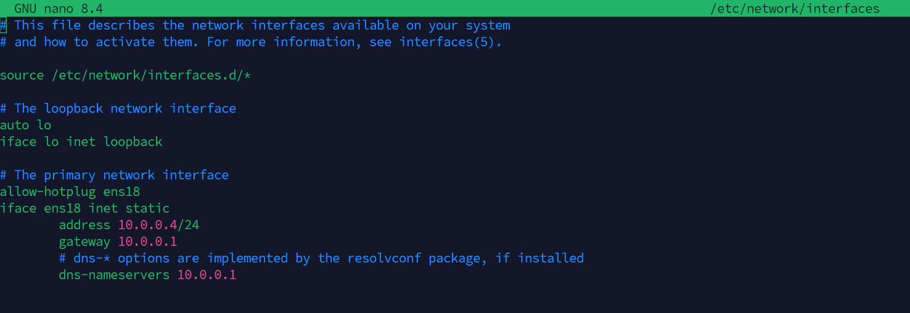

# Manual Técnico: Despliegue de n8n (Plataforma de Orquestación SOAR)

| **Variable**     | **Valor / Descripción**                               |
| :--------------- | :---------------------------------------------------- |
| **Plataforma**   | Proxmox VE                                            |
| **S.O. Guest**   | Debian 12                                             |
| **Despliegue**   | Docker & Docker Compose                               |
| **Persistencia** | Utliza SQLite                                         |
| **FQDN interno** | `n8n.ryoiki` (resolución vía Unbound DNS de OPNsense) |
| **Puerto**       | 5678 (HTTP)                                           |
| **Objetivo**     | Motor de orquestación y automatización SOAR           |

---

# Propósito y contexto

Este anexo documenta el despliegue de **n8n** como motor de orquestación y automatización (SOAR) del laboratorio. Su rol arquitectónico se describe a alto nivel en el apartado 3.2.5 (Orquestación y Automatización) de la memoria, y los dos workflows que se construyen sobre esta instalación se documentan en los anexos *Workflow SOAR* y *Bot SOC Discord*.

Este anexo se limita al **despliegue de la plataforma**: la instalación del contenedor, la configuración de red y la persistencia. La lógica funcional de cada flujo, sus nodos y los casos de uso validados se desarrollan en los anexos específicos de cada workflow.

---
# Tabla de contenidos

1. [Creación de la VM en Proxmox](#1-creación-vm-proxmox)
2. [Configuración de red](#2-configuración-red)
3. [Preparación del sistema base](#3-preparación-del-sistema-base)
4. [Instalación de Docker y Docker Compose](#4-instalación-de-docker-y-docker-compose)
5. [Configuración del entorno de n8n](#5-configuración-del-entorno-de-n8n)
6. [Despliegue del servicio y comprobación](#6-despliegue-del-servicio-y-comprobación)
   
---
## 1. Creación VM Proxmox


| Recurso       | Asignación en Proxmox | Notas                                                        |
| :------------ | :-------------------- | :----------------------------------------------------------- |
| **vCPU**      | 2 Cores               | Tipo: `host`                                                 |
| **RAM**       | 4 GiB                 | Suficiente para el motor + los dos workflows del laboratorio |
| **Disco**     | 30 GB                 | `VirtIO Block`. SQLite + logs                                |
| **Red (NIC)** | 1 interfaz            | `vmbr1` (Bridge interno del laboratorio)                     |
## 2. Configuración Red


## 2.1 Registro DNS previo en OPNsense

Para que el resto de servicios del laboratorio (especialmente el manager de Wazuh enviando webhooks y el bot Discord) puedan resolver el FQDN `n8n.ryoiki` que se utilizará como URL pública del webhook, debe crearse previamente el correspondiente *host override* en el servicio Unbound DNS de OPNsense, de forma igual a los que ya existen para `opencti.ryoiki` y `wazuh.ryoiki`.

- [x] Acceder a OPNsense → **Services > Unbound DNS > Overrides > Host Overrides**.
- [x] Clic en `+` para añadir.

| Parámetro       | Valor de Configuración      |
| :-------------- | :-------------------------- |
| **Host**        | `n8n`                       |
| **Domain**      | `ryoiki`                    |
| **IP**          | `10.0.0.5`                  |
| **Description** | `FQDN de la plataforma n8n` |

- [x] Guardar y aplicar cambios.

---
## 3. Preparación del Sistema Base

Lo primero siempre es asegurar que el sistema base está actualizado y cuenta con las dependencias esenciales para poder interactuar con repositorios externos y descargar paquetes.

```Bash
# Actualizar la lista de paquetes y el sistema
sudo apt update && sudo apt upgrade -y

# Instalar dependencias básicas
sudo apt install -y curl wget git nano apt-transport-https ca-certificates software-properties-common
```

## 4. Instalación de Docker y Docker Compose

La forma más limpia y robusta de instalar **Docker** en _Debian_ es utilizando su repositorio oficial. Este enfoque garantiza que recibiremos las últimas actualizaciones de seguridad.

```Bash

# Descargar e instalar la clave GPG oficial de Docker
sudo install -m 0755 -d /etc/apt/keyrings
sudo curl -fsSL https://download.docker.com/linux/debian/gpg -o /etc/apt/keyrings/docker.asc
sudo chmod a+r /etc/apt/keyrings/docker.asc

# Añadir el repositorio a las fuentes de apt
echo \
  "deb [arch=$(dpkg --print-architecture) signed-by=/etc/apt/keyrings/docker.asc] https://download.docker.com/linux/debian \
  $(. /etc/os-release && echo "$VERSION_CODENAME") stable" | \
  sudo tee /etc/apt/sources.list.d/docker.list > /dev/null

# Instalar Docker y sus plugins (incluido Docker Compose)
sudo apt update
sudo apt install -y docker-ce docker-ce-cli containerd.io docker-buildx-plugin docker-compose-plugin
```

## 5. Configuración del Entorno de n8n

n8n necesita un directorio local en el servidor para guardar los datos de forma persistente (flujos, credenciales, configuraciones). Por políticas de seguridad de la imagen, el contenedor se ejecuta con el usuario no privilegiado `node` (cuyo ID es `1000`).

```Bash
# Crear la carpeta principal para el proyecto 
mkdir -p /opt/n8n/data

# Cambiar los permisos para que el contenedor pueda escribir
# UID y GID 1000 corresponden al usuario 'node' dentro del contenedor
sudo chown -R 1000:1000 /opt/n8n/data
```

## Archivo `docker-compose.yml` y `.env`

Generamos el archivo de configuración para levantar el servicio utilizando la base de datos por defecto (SQLite):

```Bash
cd ~/n8n
nano docker-compose.yml
```

```yml

services:
  n8n:
    image: docker.n8n.io/n8nio/n8n:latest
    container_name: n8n_core
    restart: unless-stopped
    ports:
      - "${N8N_PORT}:5678"
    environment:
      - N8N_HOST=${N8N_HOST}
      - N8N_PORT=${N8N_PORT}
      - N8N_PROTOCOL=${N8N_PROTOCOL}
      - NODE_ENV=${NODE_ENV}
      - WEBHOOK_URL=${WEBHOOK_URL}
      - GENERIC_TIMEZONE=${GENERIC_TIMEZONE}
      - N8N_SECURE_COOKIE=false
      - N8N_RUNNERS_ENABLED=true
      - N8N_RUNNERS_MODE=internal
      - N8N_RUNNERS_AUTH_TOKEN=TokenParaMiTFG2026
    volumes:
      - ${DATA_FOLDER}:/home/node/.n8n
        
```

```env
# Configuración general
DATA_FOLDER=/opt/n8n/data
GENERIC_TIMEZONE=Europe/Madrid

# Configuración web
N8N_HOST=n8n.ryoiki
N8N_PORT=5678
N8N_PROTOCOL=http
WEBHOOK_URL=http://n8n.ryoiki:5678/

# Seguridad y entorno
NODE_ENV=production
```

## 6. Despliegue del Servicio y Comprobación

Una vez configurado el entorno, procedemos a descargar la imagen oficial y arrancar el contenedor en segundo plano (`-d` detached mode):

```Bash
# Levantar la infraestructura de n8n
sudo docker compose up -d

# Visualizar los logs en tiempo real para verificar un arranque sin errores
sudo docker compose logs -f
```

## 7. Verificación post-despliegue

Una vez levantado el contenedor, confirmar que el servicio responde correctamente:

```bash
# Comprobar que el contenedor está en estado healthy
sudo docker compose ps

# Acceder a la interfaz web desde el navegador (a través del túnel VPN WireGuard descrito en el anexo OPNsense)
# Si se accede por FQDN: http://n8n.ryoiki:5678
# Si se accede por IP: http://10.0.0.X:5678
```

En el primer acceso, n8n solicita la creación del usuario administrador. Tras este paso, la plataforma queda lista para importar los dos workflows del proyecto, documentados en los anexos *Workflow SOAR* y *Bot SOC Discord*.

## 8. Mantenimiento

### Actualizar n8n a una nueva versión

```bash
cd /opt/n8n
sudo docker compose pull
sudo docker compose up -d
```

> [!WARNING]
>  las actualizaciones mayores de n8n pueden cambiar el comportamiento de nodos o el formato de los workflows. Antes de aplicar una actualización en un entorno con flujos en producción, realizar un *snapshot* de la VM en Proxmox para permitir un rollback rápido.

### Backup de los datos persistentes

El directorio `/opt/n8n/data` contiene la base de datos SQLite con los workflows, credenciales cifradas y ejecuciones históricas. Para un backup operativo:

```bash
sudo tar -czf n8n-backup-$(date +%F).tar.gz /opt/n8n/data
```

En un entorno productivo, este backup se delegaría a Proxmox Backup Server (PBS), como se discute en el apartado 3.2.1.B de la memoria.