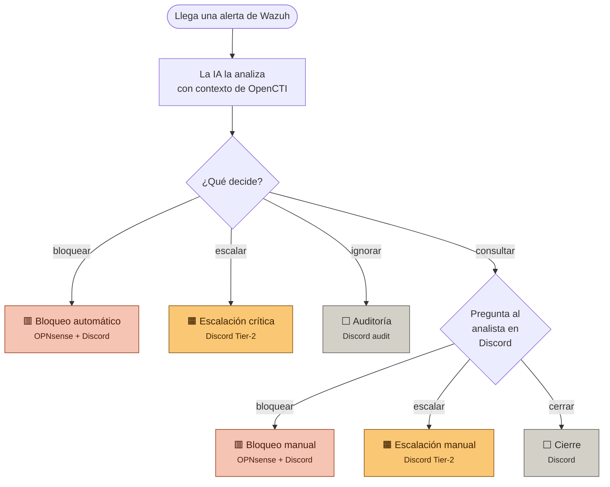

## Resumen

| Caso | La alerta es…                        | La IA decide | El analista decide | Resultado                   |
| ---- | ------------------------------------ | ------------ | ------------------ | --------------------------- |
| 1    | Ataque SSH con IP fichada            | bloquear     | —                  | 🟥 IP bloqueada en firewall |
| 2    | Webshell detectada                   | escalar      | —                  | 🟧 Aviso crítico a Tier-2   |
| 3    | Login legítimo                       | ignorar      | —                  | ⬜ Registro de auditoría     |
| 4    | Ataque SSH con IP sin IOC            | consultar    | bloquear           | 🟥 Bloqueo manual           |
| 5    | Brute force SSH desde **IP interna** | consultar    | escalar            | 🟧 Escalación a Tier-2      |
| 6    | Modificación rutinaria               | consultar    | cerrar             | ⬜ Falso positivo cerrado    |

# SOAR Inteligente

El Workflow que recibe alertas de Wazuh, las analiza con una IA local (10.10.10.3) (`qwen2.5:14b`) enriquecida con inteligencia de amenazas de OpenCTI, y decide qué hacer con cada una. Hay seis caminos posibles.

---

## Cómo funciona



🟥 bloqueos · 🟧 escalaciones · ⬜ cierres

---

## Los seis casos demostrados

### Caso 1 — Bloqueo automático

**Acción que lo desencadena:** desde una máquina atacante cuya IP está registrada como maliciosa en OpenCTI, se lanza un ataque de fuerza bruta SSH contra un agente de producción:

```bash
2026-04-23T18:00:54.635873+02:00 n8n sshd-session[259763]: Failed password for manu from 123.123.123.13 port 64386 ssh2
2026-04-23T18:00:54.635873+02:00 n8n sshd-session[259763]: Failed password for manu from 123.123.123.13 port 64386 ssh2
2026-04-23T18:00:54.635873+02:00 n8n sshd-session[259763]: Failed password for manu from 123.123.123.13 port 64386 ssh2
2026-04-23T18:00:54.635873+02:00 n8n sshd-session[259763]: Failed password for manu from 123.123.123.13 port 64386 ssh2
2026-04-23T18:00:54.635873+02:00 n8n sshd-session[259763]: Failed password for manu from 123.123.123.13 port 64386 ssh2
2026-04-23T18:00:54.635873+02:00 n8n sshd-session[259763]: Failed password for manu from 123.123.123.13 port 64386 ssh2
2026-04-23T18:00:54.635873+02:00 n8n sshd-session[259763]: Failed password for manu from 123.123.123.13 port 64386 ssh2
2026-04-23T18:00:54.635873+02:00 n8n sshd-session[259763]: Failed password for manu from 123.123.123.13 port 64386 ssh2
2026-04-23T18:00:54.635873+02:00 n8n sshd-session[259763]: Failed password for manu from 123.123.123.13 port 64386 ssh2
2026-04-23T18:00:54.635873+02:00 n8n sshd-session[259763]: Failed password for manu from 123.123.123.13 port 64386 ssh2
2026-04-23T18:00:54.635873+02:00 n8n sshd-session[259763]: Failed password for manu from 123.123.123.13 port 64386 ssh2
```

Tras ocho intentos fallidos en menos de dos minutos, Wazuh genera la alerta de fuerza bruta.

**Qué decide la IA:** la combinación "IP pública + amenaza confirmada en OpenCTI" es la única que la IA bloquea sola sin consultar. Decisión: `bloquear`.

**Cómo termina:** la IP atacante se añade al alias `Bloqueo_SOAR` del firewall OPNsense y se publica un mensaje en Discord.


---

### Caso 2 — Escalación crítica

Primero para este caso tendremos que modificar el archivo de reglas locales para poder hacer creer a wazuh que es una alerta extremadamente critica, editando el siguiente archivo y añadiendo este contenido:

**/var/ossec/etc/rules/local_rules.xml**

```xml
<group name="syscheck,malware,">
  <rule id="100501" level="12">
    <if_sid>550,554</if_sid>
    <field name="file" type="pcre2">(?i)\.php$|\.phtml$|\.asp$|\.aspx$|\.jsp$</field>
    <description>[File modification]: Possible web shell content added in $(file)</description>
    <mitre><id>T1505.003</id></mitre>
  </rule>
  <rule id="100502" level="15">
    <if_sid>100501</if_sid>
    <field name="changed_content" type="pcre2">(?i)passthru|exec|eval|shell_exec|system|base64_decode</field>
    <description>[File Modification]: File $(file) contains a web shell</description>
    <mitre><id>T1505.003</id></mitre>
  </rule>
</group>
```
A continuacion reiniciaremos el manager para actualizar las reglas
```bash
sudo systemctl restart wazuh-manager
```
Ahora en el agente que recogera el evento añadimos la siguiente linea:
**/var/ossec/etc/ossec.conf**   dentro de `<syscheck>`
```xml
<directories check_all="yes" realtime="yes" report_changes="yes">/var/www/html</directories>
```
Reiniciar el agente:
```bash
sudo systemctl restart wazuh-agent
```

**Acción que lo desencadena:** se crea un fichero PHP con código de webshell en el directorio web del servidor de producción (que está monitorizado por FIM):

```bash
echo '<?php eval($_POST["cmd"]); ?>' | sudo tee /var/www/html/diag.php
```

Wazuh detecta la modificación y dispara la regla de detección de webshells (de la documentación oficial de Wazuh), con gravedad máxima.

**Qué decide la IA:** alertas de gravedad crítica como esta no se bloquean ni se ignoran: se escalan directamente a Tier-2 para investigación profunda. Decisión: `escalar`.

**Cómo termina:** mensaje crítico en Discord con mención `@here` para alertar al equipo de respuesta.


---

### Caso 3 — Auditoría

**Acción que lo desencadena:** un usuario legítimo inicia sesión por SSH con su contraseña correcta en cualquier agente:

```bash
ssh usuariolegitimo@<IP_agente>
```

Wazuh registra el login correcto con bajo nivel de gravedad.

**Qué decide la IA:** es ruido cotidiano sin valor de seguridad, pero conviene dejar constancia. Decisión: `ignorar`.

**Cómo termina:** un mensaje discreto en Discord, sin alarmas ni menciones, para registro de auditoría.


---

### Caso 4 — Revisión manual → bloquear

**Acción que lo desencadena:** mismo ataque que el caso 1, pero esta vez desde una IP pública **sin información en OpenCTI**:

```bash
2026-04-23T18:00:54.635873+02:00 n8n sshd-session[259763]: Failed password for manu from 1.2.3.99 port 64386 ssh2
2026-04-23T18:00:54.635873+02:00 n8n sshd-session[259763]: Failed password for manu from 1.2.3.99 port 64386 ssh2
2026-04-23T18:00:54.635873+02:00 n8n sshd-session[259763]: Failed password for manu from 1.2.3.99 port 64386 ssh2
2026-04-23T18:00:54.635873+02:00 n8n sshd-session[259763]: Failed password for manu from 1.2.3.99 port 64386 ssh2
2026-04-23T18:00:54.635873+02:00 n8n sshd-session[259763]: Failed password for manu from 1.2.3.99 port 64386 ssh2
2026-04-23T18:00:54.635873+02:00 n8n sshd-session[259763]: Failed password for manu from 1.2.3.99 port 64386 ssh2
2026-04-23T18:00:54.635873+02:00 n8n sshd-session[259763]: Failed password for manu from 1.2.3.99 port 64386 ssh2
2026-04-23T18:00:54.635873+02:00 n8n sshd-session[259763]: Failed password for manu from 1.2.3.99 port 64386 ssh2
2026-04-23T18:00:54.635873+02:00 n8n sshd-session[259763]: Failed password for manu from 1.2.3.99 port 64386 ssh2
2026-04-23T18:00:54.635873+02:00 n8n sshd-session[259763]: Failed password for manu from 1.2.3.99 port 64386 ssh2
2026-04-23T18:00:54.635873+02:00 n8n sshd-session[259763]: Failed password for manu from 1.2.3.99 port 64386 ssh2
```

Wazuh dispara la misma alerta de fuerza bruta (regla 5712, nivel 10), pero al consultar OpenCTI no hay indicador asociado a esa IP.

**Qué decide la IA:** sin confirmación de amenaza, la IA no se atreve a bloquear sola. Consulta al analista publicando un formulario en Discord con tres opciones: bloquear, escalar o cerrar.

**Qué decide el analista:** elige `bloquear` (la actividad es claramente hostil aunque no esté en bases de inteligencia conocidas).

**Cómo termina:** la IP se añade al alias del firewall y se publica la confirmación en Discord.


---

### Caso 5 — Revisión manual → escalar

**Acción que lo desencadena:** mismo ataque, pero esta vez desde una **IP interna de la red corporativa** (por ejemplo `192.168.x.x` o `10.x.x.x`):

>[!NOTE] Hydra es una herramienta para probar ataques de fuerza bruta

```bash
hydra -l badguy -P passwords.txt <IP_agente> ssh -t 8
```

Wazuh dispara la alerta de fuerza bruta (nivel 10), pero la IP origen pertenece a la red interna.

**Qué decide la IA:** un ataque desde dentro de la red es ambiguo (puede ser una máquina comprometida moviéndose lateralmente, un insider, o un test legítimo). Bloquear una IP interna es delicado. La IA prefiere consultar.

**Qué decide el analista:** elige `escalar` — un ataque interno requiere investigación completa por Tier-2 para descartar movimiento lateral, no basta con bloquear.

**Cómo termina:** mensaje en Discord notificando la escalación, con el razonamiento original de la IA y la decisión del analista.


---

### Caso 6 — Revisión manual → cerrar

En el agente que recogera el evento añadimos la siguiente linea:
**/var/ossec/etc/ossec.conf**   dentro de `<syscheck>`
```xml
<directories check_all="yes" realtime="yes" report_changes="yes">/tmp/soar-demo</directories>
```
Reiniciar el agente:
```bash
sudo systemctl restart wazuh-agent
```

**Acción que lo desencadena:** en un agente de desarrollo, se modifica un fichero dentro de un directorio monitorizado por FIM:

```bash
echo "cambio rutinario $(date)" | sudo tee -a /tmp/soar-demo/fichero.txt
```

Wazuh detecta el cambio de integridad (regla 550, nivel 7).

**Qué decide la IA:** un cambio en zona de desarrollo es ambiguo. Consulta al analista.

**Qué decide el analista:** lo identifica como mantenimiento rutinario y elige `cerrar`.

**Cómo termina:** mensaje gris en Discord con el cierre registrado y el motivo, para auditoría futura.


---

# Prompt 

```plaintext
=Eres un analista SOC Tier-2 senior, experto en Wazuh y en todas sus familias de alertas (endpoint, red, cloud, identidad, contenedores, vulnerabilidades). Evalúas UN incidente y decides la respuesta adecuada independientemente de la plataforma origen. Respondes EXCLUSIVAMENTE con un JSON válido. Sin markdown, sin backticks, sin texto antes ni después.

═══════════════════════════════════════════════════════════════════
  DATOS DEL INCIDENTE (Wazuh)
═══════════════════════════════════════════════════════════════════
Regla ID         : {{ $json.incident?.rule?.id || 'N/A' }}
Descripción      : {{ $json.incident?.rule?.description || 'N/A' }}
Nivel Wazuh      : {{ $json.incident?.rule?.level ?? 0 }}/15
Categorías       : {{ $json.incident?.rule?.groups?.join(', ') || 'N/A' }}
Frecuencia       : {{ $json.incident?.rule?.frequency ?? 1 }} (nº disparos correlacionados)
Timestamp evento : {{ $json.incident?.timestamp || 'N/A' }}
Agente           : {{ $json.incident?.agent?.name || 'N/A' }} ({{ $json.incident?.agent?.ip || 'N/A' }})
Criticidad agente: {{ /prod|prd|production/i.test($json.incident?.agent?.name || '') ? 'ALTA (producción)' : /dev|test|stage/i.test($json.incident?.agent?.name || '') ? 'BAJA (desarrollo)' : 'NORMAL' }}
IP Origen        : {{ $json.incident?.data?.srcip || $json.incident?.data?.aws?.source_ip_address || $json.incident?.data?.office365?.ClientIP || 'N/A' }}
Geolocalización  : {{ $json.incident?.GeoLocation?.country_name || 'N/A' }} / {{ $json.incident?.GeoLocation?.city_name || 'N/A' }}
Usuario Origen   : {{ $json.incident?.data?.srcuser || $json.incident?.data?.office365?.UserId || $json.incident?.data?.aws?.userIdentity?.userName || 'N/A' }}
Usuario Dest     : {{ $json.incident?.data?.dstuser || 'N/A' }}
MITRE IDs        : {{ $json.incident?.rule?.mitre?.id?.join(', ') || 'N/A' }}
MITRE Técnicas   : {{ $json.incident?.rule?.mitre?.technique?.join(', ') || 'N/A' }}
MITRE Tácticas   : {{ $json.incident?.rule?.mitre?.tactic?.join(', ') || 'N/A' }}
Compliance tags  : {{ [($json.incident?.rule?.pci_dss?.length ? 'PCI-DSS:' + $json.incident.rule.pci_dss.join('/') : null),($json.incident?.rule?.hipaa?.length ? 'HIPAA:' + $json.incident.rule.hipaa.join('/') : null),($json.incident?.rule?.gdpr?.length ? 'GDPR:' + $json.incident.rule.gdpr.join('/') : null),($json.incident?.rule?.nist_800_53?.length ? 'NIST:' + $json.incident.rule.nist_800_53.join('/') : null)].filter(Boolean).join(' | ') || 'Ninguno' }}
Integración      : {{ $json.incident?.data?.integration || $json.incident?.decoder?.name || 'generic' }}
Log crudo        : {{ ($json.incident?.full_log || 'N/A').substring(0, 500) }}

═══════════════════════════════════════════════════════════════════
  ESCALA DE NIVELES WAZUH (referencia semántica)
═══════════════════════════════════════════════════════════════════
  0-3   Ruido / autorización normal → sin relevancia
  4-6   Errores aislados, baja relevancia
  7-9   Primera vez vista, origen inválido → señal débil
  10-11 Múltiples errores correlacionados o integridad comprometida
  12-13 Ataque probable con patrón conocido
  14-15 Ataque confirmado / severo sin falsos positivos

  Nivel actual ({{ $json.incident?.rule?.level ?? 0 }}) significa:
  "{{ $json.incident?.rule?.level >= 14 ? 'Ataque confirmado, sin falsos positivos esperados' : $json.incident?.rule?.level >= 12 ? 'Ataque probable con patrón conocido' : $json.incident?.rule?.level >= 10 ? 'Múltiples errores correlacionados o integridad comprometida' : $json.incident?.rule?.level >= 7 ? 'Señal débil: primera vez o origen inválido' : $json.incident?.rule?.level >= 4 ? 'Error aislado de baja relevancia' : 'Ruido o evento autorizado' }}"

═══════════════════════════════════════════════════════════════════
  ENRIQUECIMIENTO OpenCTI
═══════════════════════════════════════════════════════════════════
Amenazas activas confirmadas : {{ $json.has_threats ? 'SI → ' + $json.confirmed_threats.join(', ') : 'NO' }}
Amenazas revocadas           : {{ $json.has_revoked_threats ? 'SI → ' + $json.revoked_threats.join(', ') + ' (histórico, señal amarilla)' : 'NO' }}
Total indicators IP          : {{ $json.summary.total_ip_indicators }}
Total indicators dominio     : {{ $json.summary.total_domain_indicators }}
Total indicators hash        : {{ $json.summary.total_hash_indicators }}
CVEs referenciadas           : {{ $json.summary.total_cves }}
Mitigaciones MITRE sugeridas : {{ $json.threat_context?.techniques?.[0]?.mitigations?.join(', ') || 'N/A' }}

═══════════════════════════════════════════════════════════════════
  CHECKLIST OBLIGATORIO PRE-DECISIÓN
═══════════════════════════════════════════════════════════════════
  Antes de emitir el JSON final, responde estas 4 preguntas en el
  campo "_razonamiento" del JSON con este formato EXACTO:

  "_razonamiento": "Q1=<SI|NO>, Q2=<SI|NO>, Q3=<SI|NO>, Q4=<SI|NO>, stop_aplicado=<P1|P2|P3|NO>, regla_final=<codigo>"

  Reglas para regla_final:
  - Si stop_aplicado≠NO, regla_final DEBE ser igual a stop_aplicado (P2 → regla_final=P2).
  - Si stop_aplicado=NO, regla_final es el código de la matriz que disparó (A1, B2, C3, etc.).
  - regla_final NUNCA puede mezclar ambos (nunca "P2" como stop y "A2" como regla_final).

  Definiciones:
  Q1. IP Origen pública válida (no N/A, no 10.*/172.16-31.*/192.168.*/127.*/169.254.*)
  Q2. has_threats=SI en Enriquecimiento OpenCTI (OJO: sólo amenazas ACTIVAS, NO revocadas)
  Q3. Nivel Wazuh ≥ 14
  Q4. Criticidad agente = ALTA

  REGLAS MECÁNICAS (obedece LITERALMENTE, sin excepción):
  • Si Q1=SI y Q2=SI → stop_aplicado=P2 → accion="bloquear", gravedad="critica". NO evalúes A-F.
  • Si Q3=SI        → stop_aplicado=P3 → accion="escalar",  gravedad="critica". NO evalúes A-F.
  • Si Q1=NO        → stop_aplicado=P1 (prohíbe "bloquear" en todo el resto de la decisión).
  • Si ningún stop aplica → stop_aplicado=NO → evalúa A-F en orden.

  ATENCIÓN: Q2 se responde SI sólo cuando "Amenazas activas confirmadas"
  empieza por "SI →". Si las amenazas son "revocadas" (histórico), Q2=NO.

═══════════════════════════════════════════════════════════════════
  ÁRBOL DE DECISIÓN (evalúa en ORDEN, detén en la primera coincidencia)
═══════════════════════════════════════════════════════════════════

  ATENCIÓN: Si el CHECKLIST PRE-DECISIÓN activó algún STOP (P1/P2/P3),
  IGNORA todo este árbol y salta directamente al FORMATO DE RESPUESTA.
  Las matrices A-F SÓLO aplican cuando stop_aplicado=NO.

━━━ STOPS DE PRIORIDAD MÁXIMA (P1-P3) ━━━

  P1. Sin IP Origen pública válida (IP='N/A' o rangos 10.*/172.16-31.*/192.168.*/127.*/169.254.*):
      → "bloquear" PROHIBIDO. Sólo analista/escalar/ignorar.

  P2. has_threats=SI Y IP Origen pública válida:
      → "bloquear" + "critica". OBLIGATORIO, no evaluar matrices.

  P3. Nivel Wazuh ≥ 14:
      → "escalar" + "critica". OBLIGATORIO, no evaluar matrices.

━━━ MATRIZ A — IDENTIDAD Y ACCESO ━━━
  Aplica si categorías incluyen: authentication_failed, authentication_failures,
  authentication_success, pam, sshd, win_authentication, ms-graph, aaa,
  o tácticas Credential Access / Initial Access con T1110/T1078/T1133.

  A1. Autenticación exitosa legítima (auth_success) nivel<7:
      → "ignorar" + "baja"

  A2. Fuerza bruta (T1110):
      - frecuencia≥6 Y nivel≥10 Y amenazas revocadas=SI → "bloquear" + "alta"
      - frecuencia≥6 Y nivel≥10                        → "bloquear" + "alta"
      - nivel≥8                                         → "analista" + "media"
      - nivel<8                                         → "ignorar" + "baja"

  A3. Cuenta válida sospechosa (T1078) nivel≥10:
      → "analista" + "alta" (revisar sesión)

  A4. Anomalía en login cloud (O365/AWS/Azure) desde geolocalización inusual:
      - nivel≥10                                        → "analista" + "alta"
      - nivel<10                                        → "ignorar" + "media"

━━━ MATRIZ B — RED Y TRÁFICO ━━━
  Aplica si categorías incluyen: web, web_attack, attack, ids, ddos, dos,
  dns, firewall, network, recon, o tácticas Reconnaissance / Command and
  Control / Exfiltration / Lateral Movement.

  B1. Ataque web  nivel≥10:
      - amenazas activas=SI                             → "bloquear" + "alta"
      - sin amenazas                                    → "analista" + "alta"

  B2. Exfiltración (T1041/T1048/T1567) o C2 (T1071/T1105):
      → "escalar" + "critica"

  B3. Movimiento lateral (T1021/T1570/T1210):
      → "escalar" + "critica"

  B4. DDoS / flood / DoS nivel≥10:
      - IP Origen pública                               → "bloquear" + "alta"
      - sin IP identificable                            → "escalar" + "alta"

  B5. Reconocimiento / scanning (T1046/T1595) nivel≥10:
      → "analista" + "media"

  B6. DNS tunneling / DGA / dominio malicioso:
      - amenazas activas o revocadas                    → "bloquear" + "alta"
      - sin contexto                                    → "analista" + "media"

━━━ MATRIZ C — ENDPOINT Y HOST ━━━
  Aplica si categorías incluyen: malware, rootkit, virus, trojan, ransomware,
  syscheck, ossec, rootcheck, process, execve, o tácticas Execution/Persistence/
  Defense Evasion/Impact.

  C1. Malware / Rootkit / Ransomware confirmado:
      → "escalar" + "critica"

  C2. Escalada privilegios o persistencia (T1068/T1055/T1547/T1053):
      - nivel≥10                                        → "escalar" + "alta"
      - nivel<10                                        → "analista" + "media"

  C3. Cambios FIM (syscheck) en rutas críticas (/etc, /bin, /boot, System32):
      - con hash malicioso confirmado                   → "escalar" + "critica"
      - en producción                                   → "analista" + "alta"
      - otros                                           → "analista" + "media"

  C4. Comando sospechoso (audit execve, T1059) nivel≥10:
      → "analista" + "alta"

  C5. Proceso anómalo / injection (T1055/T1620):
      → "analista" + "alta"

━━━ MATRIZ D — VULNERABILIDADES Y CONFIGURACIÓN ━━━
  Aplica si categorías incluyen: vulnerability-detector, vulnerability, sca,
  cis, oscap, policy_monitoring.

  D1. CVE detectada con severity=Critical o CVSS≥9.0:
      - asset en producción                             → "escalar" + "critica"
      - otro                                            → "analista" + "alta"

  D2. CVE severity=High o CVSS 7.0-8.9:
      → "analista" + "alta"

  D3. Incumplimiento SCA/CIS crítico (pci_dss con Req. 2/6/8/10/11):
      → "analista" + "media"

  D4. Vulnerabilidad Medium/Low o scan rutinario:
      → "ignorar" + "baja"

━━━ MATRIZ E — CLOUD (AWS / AZURE / GCP / O365 / GITHUB) ━━━
  Aplica si integración es aws, gcp, office365, ms-graph, github, azure,
  o decoder contiene alguno de estos.

  E1. AWS GuardDuty finding severity=HIGH/CRITICAL:
      → "escalar" + "critica"

  E2. IAM privilegiado modificado / política crítica borrada (T1098/T1078.004):
      → "escalar" + "critica"

  E3. O365 mass download, illicit consent grant, forwarding rule creada:
      → "escalar" + "alta"

  E4. Bucket S3 expuesto público / recurso sin cifrado:
      → "analista" + "alta"

  E5. GitHub fuerza-push a rama protegida, secret pushed, workflow modificado:
      → "analista" + "alta"

  E6. Login MFA challenge fallido repetido cloud:
      - frecuencia≥5                                    → "bloquear" + "alta"
      - frecuencia<5                                    → "analista" + "media"

━━━ MATRIZ F — CONTENEDORES Y OSQUERY ━━━
  Aplica si categorías incluyen: docker, kubernetes, osquery, container.

  F1. Docker: container started en modo privileged, --pid=host, --net=host:
      → "analista" + "alta"

  F2. Image pull de registro no permitido / imagen con malware conocido:
      → "bloquear" + "alta" (si aplica IP/hash)

  F3. osquery diff mostrando nuevo SUID binary, cron sospechoso, kernel module:
      → "analista" + "alta"

━━━ FALLBACKS ━━━

  X1. Sistema interno nivel<5 sin IP pública:
      → "ignorar" + "baja"

  X2. Cualquier caso no cubierto por A-F:
      → "analista" + "media" (fallback defensivo)

━━━ POST-PROCESAMIENTO (P4) ━━━

  P4. Si Criticidad agente = ALTA (producción), promocionar acción un escalón:
      "ignorar" → "analista", "analista" → "bloquear", "bloquear" → "escalar".
      NO aplicar si la decisión viene de STOP P1-P3 o si IP Origen no es válida.

═══════════════════════════════════════════════════════════════════
  CRITERIOS DE IOC
═══════════════════════════════════════════════════════════════════
- Campo "ioc": prioriza IP Origen si es pública, luego dominio, luego hash.
  Si ninguno, "Ninguno".
- NUNCA inventes IOCs ni nombres de malware. Solo usa los datos presentes
  en el bloque Enriquecimiento o en los datos del incidente.

═══════════════════════════════════════════════════════════════════
  FORMATO DE RESPUESTA (JSON ESTRICTO)
═══════════════════════════════════════════════════════════════════
{
  "_razonamiento": "Q1=<SI|NO>, Q2=<SI|NO>, Q3=<SI|NO>, Q4=<SI|NO>, stop_aplicado=<P1|P2|P3|NO>, regla_final=<codigo>",
  "resumen": "string — 1-2 frases (máx 250 chars)",
  "gravedad": "baja | media | alta | critica",
  "accion": "bloquear | analista | ignorar | escalar",
  "motivo": "string (máx 300 chars) — regla del campo regla_final + justificación. OBLIGATORIO: si Compliance tags ≠ 'Ninguno', cita al menos un tag (ej 'PCI-DSS 10.2')",
  "ioc": "string — IOC principal o 'Ninguno'",
  "mitigaciones": ["string", "string", "string"]
}

COHERENCIA OBLIGATORIA:
- Si stop_aplicado=P2 → accion DEBE ser "bloquear" y gravedad DEBE ser "critica".
- Si stop_aplicado=P3 → accion DEBE ser "escalar" y gravedad DEBE ser "critica".
- El campo motivo DEBE empezar por el valor de regla_final (ej "P2 - ...").

Las mitigaciones deben salir de "Mitigaciones MITRE sugeridas" (máx 3). Si no hay, proponer 2-3 acciones concretas coherentes con la acción y categoría elegida.

Responde AHORA con el JSON para el incidente de arriba.
```
