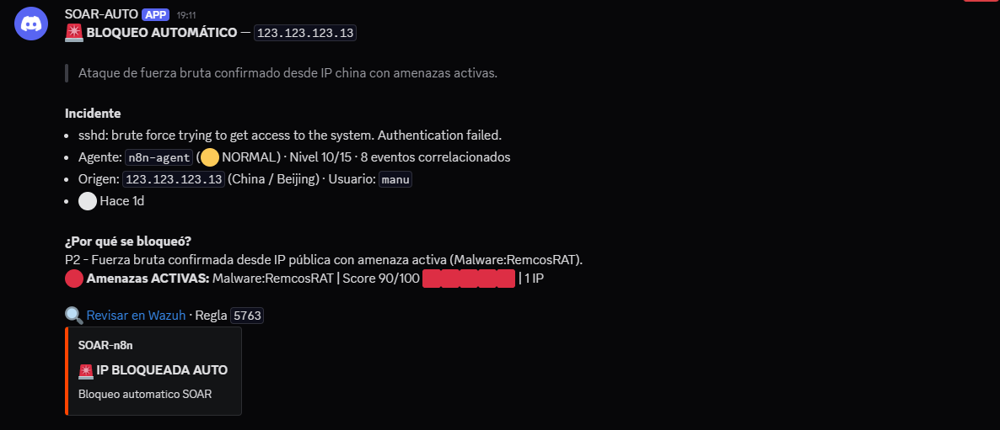
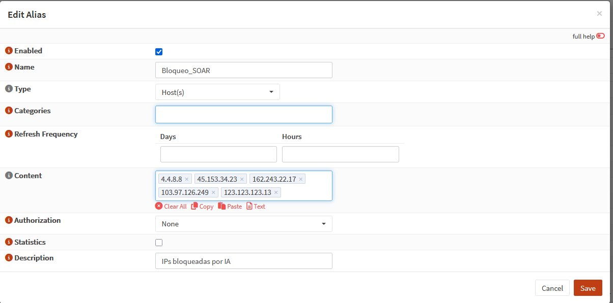
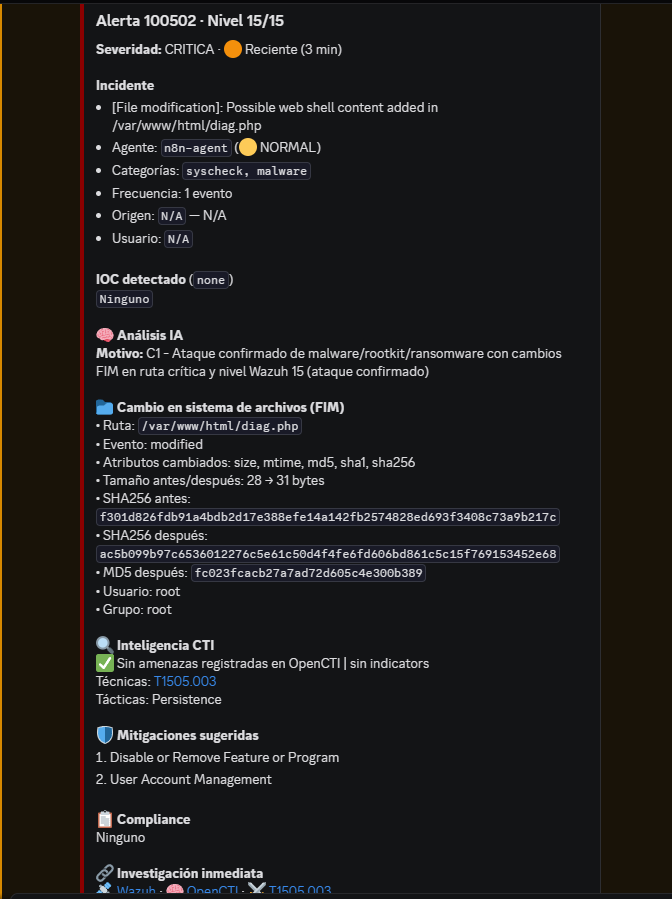
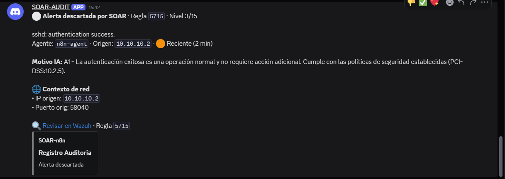
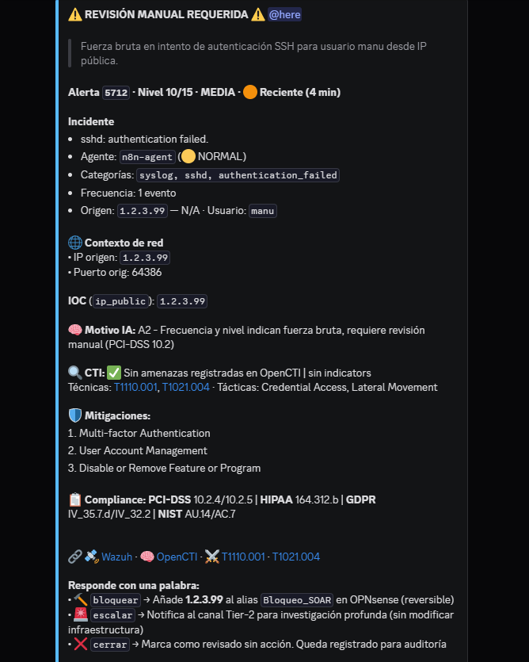
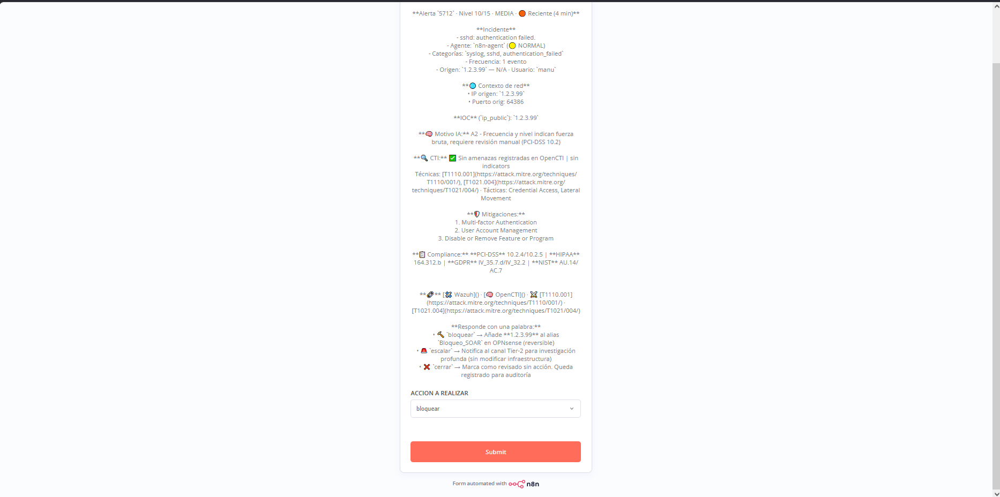
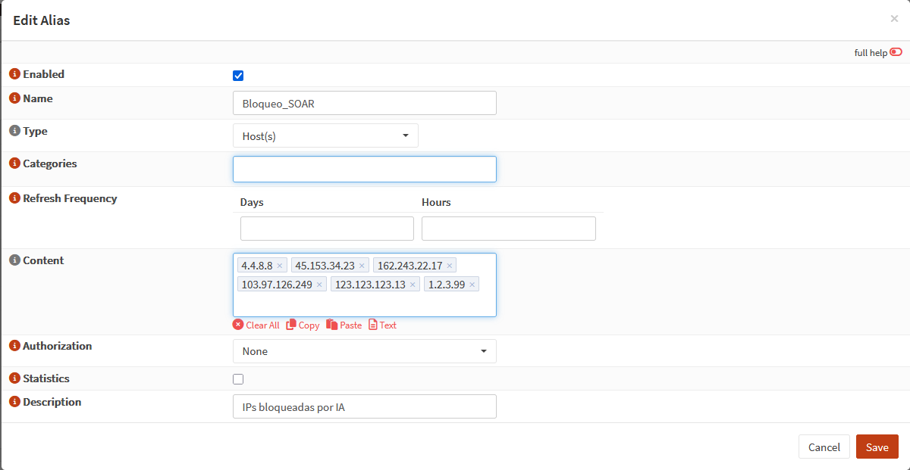
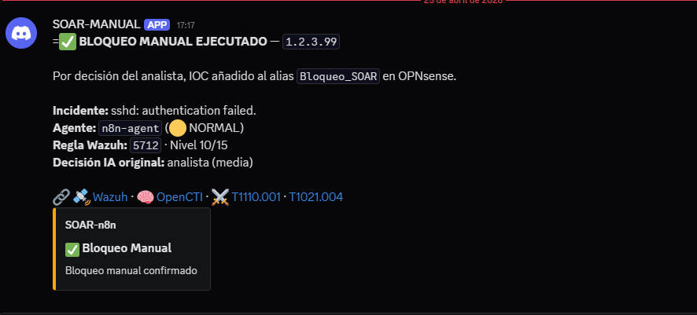
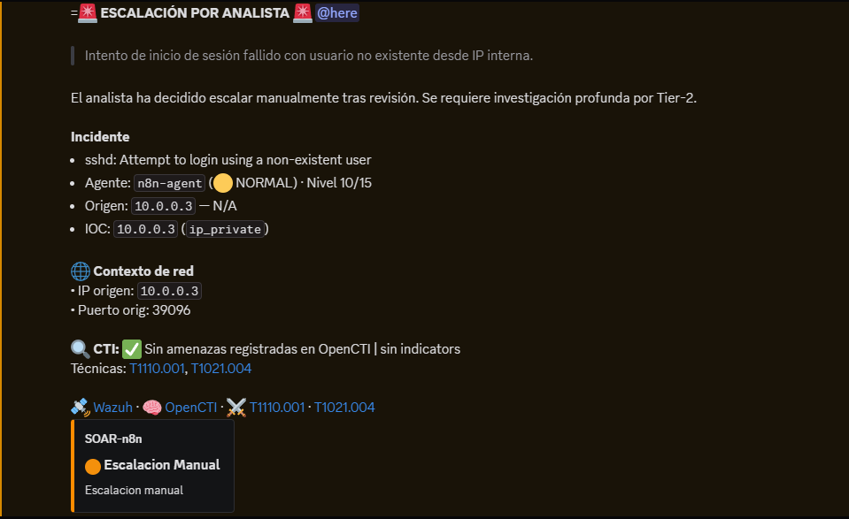
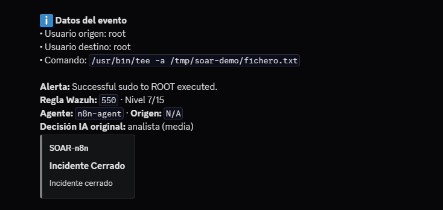

## Resumen

| Caso | La alerta es…                        | La IA decide | El analista decide | Resultado                   |
| ---- | ------------------------------------ | ------------ | ------------------ | --------------------------- |
| 1    | Ataque SSH con IP fichada            | bloquear     | —                  | 🟥 IP bloqueada en firewall |
| 2    | Webshell detectada                   | escalar      | —                  | 🟧 Aviso crítico a Tier-2   |
| 3    | Login legítimo                       | ignorar      | —                  | ⬜ Registro de auditoría     |
| 4    | Ataque SSH con IP sin IOC            | consultar    | bloquear           | 🟥 Bloqueo manual           |
| 5    | Brute force SSH desde **IP interna** | consultar    | escalar            | 🟧 Escalación a Tier-2      |
| 6    | Modificación rutinaria               | consultar    | cerrar             | ⬜ Falso positivo cerrado    |

# SOAR Inteligente

El Workflow que recibe alertas de Wazuh, las analiza con una IA local (10.10.10.3) (`qwen2.5:14b`) enriquecida con inteligencia de amenazas de OpenCTI, y decide qué hacer con cada una. Hay seis caminos posibles.

---

## Cómo funciona


🟥 bloqueos · 🟧 escalaciones · ⬜ cierres

---

## Los seis casos demostrados

### Caso 1 — Bloqueo automático

**Acción que lo desencadena:** desde una máquina atacante cuya IP está registrada como maliciosa en OpenCTI, se lanza un ataque de fuerza bruta SSH contra un agente de producción:

```bash
2026-04-23T18:00:54.635873+02:00 n8n sshd-session[259763]: Failed password for manu from 123.123.123.13 port 64386 ssh2
2026-04-23T18:00:54.635873+02:00 n8n sshd-session[259763]: Failed password for manu from 123.123.123.13 port 64386 ssh2
2026-04-23T18:00:54.635873+02:00 n8n sshd-session[259763]: Failed password for manu from 123.123.123.13 port 64386 ssh2
2026-04-23T18:00:54.635873+02:00 n8n sshd-session[259763]: Failed password for manu from 123.123.123.13 port 64386 ssh2
2026-04-23T18:00:54.635873+02:00 n8n sshd-session[259763]: Failed password for manu from 123.123.123.13 port 64386 ssh2
2026-04-23T18:00:54.635873+02:00 n8n sshd-session[259763]: Failed password for manu from 123.123.123.13 port 64386 ssh2
2026-04-23T18:00:54.635873+02:00 n8n sshd-session[259763]: Failed password for manu from 123.123.123.13 port 64386 ssh2
2026-04-23T18:00:54.635873+02:00 n8n sshd-session[259763]: Failed password for manu from 123.123.123.13 port 64386 ssh2
2026-04-23T18:00:54.635873+02:00 n8n sshd-session[259763]: Failed password for manu from 123.123.123.13 port 64386 ssh2
2026-04-23T18:00:54.635873+02:00 n8n sshd-session[259763]: Failed password for manu from 123.123.123.13 port 64386 ssh2
2026-04-23T18:00:54.635873+02:00 n8n sshd-session[259763]: Failed password for manu from 123.123.123.13 port 64386 ssh2
```

Tras ocho intentos fallidos en menos de dos minutos, Wazuh genera la alerta de fuerza bruta.

**Qué decide la IA:** la combinación "IP pública + amenaza confirmada en OpenCTI" es la única que la IA bloquea sola sin consultar. Decisión: `bloquear`.

**Cómo termina:** la IP atacante se añade al alias `Bloqueo_SOAR` del firewall OPNsense y se publica un mensaje en Discord.





---

### Caso 2 — Escalación crítica

Primero para este caso tendremos que modificar el archivo de reglas locales para poder hacer creer a wazuh que es una alerta extremadamente critica, editando el siguiente archivo y añadiendo este contenido:

**/var/ossec/etc/rules/local_rules.xml**

```xml
<group name="syscheck,malware,">
  <rule id="100501" level="12">
    <if_sid>550,554</if_sid>
    <field name="file" type="pcre2">(?i)\.php$|\.phtml$|\.asp$|\.aspx$|\.jsp$</field>
    <description>[File modification]: Possible web shell content added in $(file)</description>
    <mitre><id>T1505.003</id></mitre>
  </rule>
  <rule id="100502" level="15">
    <if_sid>100501</if_sid>
    <field name="changed_content" type="pcre2">(?i)passthru|exec|eval|shell_exec|system|base64_decode</field>
    <description>[File Modification]: File $(file) contains a web shell</description>
    <mitre><id>T1505.003</id></mitre>
  </rule>
</group>
```
A continuacion reiniciaremos el manager para actualizar las reglas
```bash
sudo systemctl restart wazuh-manager
```
Ahora en el agente que recogera el evento añadimos la siguiente linea:
**/var/ossec/etc/ossec.conf**   dentro de `<syscheck>`
```xml
<directories check_all="yes" realtime="yes" report_changes="yes">/var/www/html</directories>
```
Reiniciar el agente:
```bash
sudo systemctl restart wazuh-agent
```

**Acción que lo desencadena:** se crea un fichero PHP con código de webshell en el directorio web del servidor de producción (que está monitorizado por FIM):

```bash
echo '<?php eval($_POST["cmd"]); ?>' | sudo tee /var/www/html/diag.php
```

Wazuh detecta la modificación y dispara la regla de detección de webshells (de la documentación oficial de Wazuh), con gravedad máxima.

**Qué decide la IA:** alertas de gravedad crítica como esta no se bloquean ni se ignoran: se escalan directamente a Tier-2 para investigación profunda. Decisión: `escalar`.

**Cómo termina:** mensaje crítico en Discord con mención `@here` para alertar al equipo de respuesta.



---

### Caso 3 — Auditoría

**Acción que lo desencadena:** un usuario legítimo inicia sesión por SSH con su contraseña correcta en cualquier agente:

```bash
ssh usuariolegitimo@<IP_agente>
```

Wazuh registra el login correcto con bajo nivel de gravedad.

**Qué decide la IA:** es ruido cotidiano sin valor de seguridad, pero conviene dejar constancia. Decisión: `ignorar`.

**Cómo termina:** un mensaje discreto en Discord, sin alarmas ni menciones, para registro de auditoría.


---

### Caso 4 — Revisión manual → bloquear

**Acción que lo desencadena:** mismo ataque que el caso 1, pero esta vez desde una IP pública **sin información en OpenCTI**:

```bash
2026-04-23T18:00:54.635873+02:00 n8n sshd-session[259763]: Failed password for manu from 1.2.3.99 port 64386 ssh2
2026-04-23T18:00:54.635873+02:00 n8n sshd-session[259763]: Failed password for manu from 1.2.3.99 port 64386 ssh2
2026-04-23T18:00:54.635873+02:00 n8n sshd-session[259763]: Failed password for manu from 1.2.3.99 port 64386 ssh2
2026-04-23T18:00:54.635873+02:00 n8n sshd-session[259763]: Failed password for manu from 1.2.3.99 port 64386 ssh2
2026-04-23T18:00:54.635873+02:00 n8n sshd-session[259763]: Failed password for manu from 1.2.3.99 port 64386 ssh2
2026-04-23T18:00:54.635873+02:00 n8n sshd-session[259763]: Failed password for manu from 1.2.3.99 port 64386 ssh2
2026-04-23T18:00:54.635873+02:00 n8n sshd-session[259763]: Failed password for manu from 1.2.3.99 port 64386 ssh2
2026-04-23T18:00:54.635873+02:00 n8n sshd-session[259763]: Failed password for manu from 1.2.3.99 port 64386 ssh2
2026-04-23T18:00:54.635873+02:00 n8n sshd-session[259763]: Failed password for manu from 1.2.3.99 port 64386 ssh2
2026-04-23T18:00:54.635873+02:00 n8n sshd-session[259763]: Failed password for manu from 1.2.3.99 port 64386 ssh2
2026-04-23T18:00:54.635873+02:00 n8n sshd-session[259763]: Failed password for manu from 1.2.3.99 port 64386 ssh2
```

Wazuh dispara la misma alerta de fuerza bruta (regla 5712, nivel 10), pero al consultar OpenCTI no hay indicador asociado a esa IP.

**Qué decide la IA:** sin confirmación de amenaza, la IA no se atreve a bloquear sola. Consulta al analista publicando un formulario en Discord con tres opciones: bloquear, escalar o cerrar.

**Qué decide el analista:** elige `bloquear` (la actividad es claramente hostil aunque no esté en bases de inteligencia conocidas).

**Cómo termina:** la IP se añade al alias del firewall y se publica la confirmación en Discord.






---

### Caso 5 — Revisión manual → escalar

**Acción que lo desencadena:** mismo ataque, pero esta vez desde una **IP interna de la red corporativa** (por ejemplo `192.168.x.x` o `10.x.x.x`):

>[!NOTE] Hydra es una herramienta para probar ataques de fuerza bruta

```bash
hydra -l badguy -P passwords.txt <IP_agente> ssh -t 8
```

Wazuh dispara la alerta de fuerza bruta (nivel 10), pero la IP origen pertenece a la red interna.

**Qué decide la IA:** un ataque desde dentro de la red es ambiguo (puede ser una máquina comprometida moviéndose lateralmente, un insider, o un test legítimo). Bloquear una IP interna es delicado. La IA prefiere consultar.

**Qué decide el analista:** elige `escalar` — un ataque interno requiere investigación completa por Tier-2 para descartar movimiento lateral, no basta con bloquear.

**Cómo termina:** mensaje en Discord notificando la escalación, con el razonamiento original de la IA y la decisión del analista.



---

### Caso 6 — Revisión manual → cerrar

En el agente que recogera el evento añadimos la siguiente linea:
**/var/ossec/etc/ossec.conf**   dentro de `<syscheck>`
```xml
<directories check_all="yes" realtime="yes" report_changes="yes">/tmp/soar-demo</directories>
```
Reiniciar el agente:
```bash
sudo systemctl restart wazuh-agent
```

**Acción que lo desencadena:** en un agente de desarrollo, se modifica un fichero dentro de un directorio monitorizado por FIM:

```bash
echo "cambio rutinario $(date)" | sudo tee -a /tmp/soar-demo/fichero.txt
```

Wazuh detecta el cambio de integridad (regla 550, nivel 7).

**Qué decide la IA:** un cambio en zona de desarrollo es ambiguo. Consulta al analista.

**Qué decide el analista:** lo identifica como mantenimiento rutinario y elige `cerrar`.

**Cómo termina:** mensaje gris en Discord con el cierre registrado y el motivo, para auditoría futura.




---
