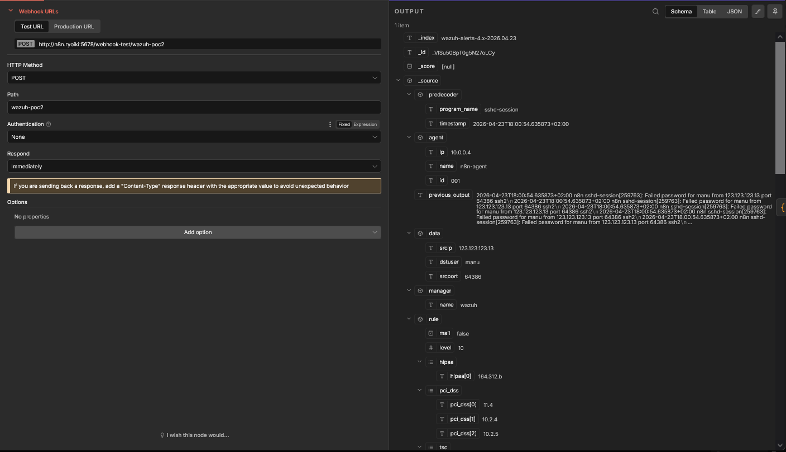

# 1- Fuerza bruta SSH 

**Qué hacer**: desde otra máquina, intentar login SSH fallido varias veces al servidor del agente Wazuh.

podriamos hacerlo desde una maquina local cualquier a la cual tengamos acceso directo pero esto nos bloqueria nuestra propia IP por lo que simulamos el ataque mediante la inserccion de las siguientes lineas en el archivo /var/log/auth.log

```bash
2026-04-23T18:00:54.635873+02:00 n8n sshd-session[259763]: Failed password for manu from 123.123.123.13 port 64386 ssh2
2026-04-23T18:00:54.635873+02:00 n8n sshd-session[259763]: Failed password for manu from 123.123.123.13 port 64386 ssh2
2026-04-23T18:00:54.635873+02:00 n8n sshd-session[259763]: Failed password for manu from 123.123.123.13 port 64386 ssh2
2026-04-23T18:00:54.635873+02:00 n8n sshd-session[259763]: Failed password for manu from 123.123.123.13 port 64386 ssh2
2026-04-23T18:00:54.635873+02:00 n8n sshd-session[259763]: Failed password for manu from 123.123.123.13 port 64386 ssh2
2026-04-23T18:00:54.635873+02:00 n8n sshd-session[259763]: Failed password for manu from 123.123.123.13 port 64386 ssh2
2026-04-23T18:00:54.635873+02:00 n8n sshd-session[259763]: Failed password for manu from 123.123.123.13 port 64386 ssh2
2026-04-23T18:00:54.635873+02:00 n8n sshd-session[259763]: Failed password for manu from 123.123.123.13 port 64386 ssh2
2026-04-23T18:00:54.635873+02:00 n8n sshd-session[259763]: Failed password for manu from 123.123.123.13 port 64386 ssh2
2026-04-23T18:00:54.635873+02:00 n8n sshd-session[259763]: Failed password for manu from 123.123.123.13 port 64386 ssh2
2026-04-23T18:00:54.635873+02:00 n8n sshd-session[259763]: Failed password for manu from 123.123.123.13 port 64386 ssh2
```

## Recogemos alerta de wazuh mediante agente

Vemos que recogemos los datos
