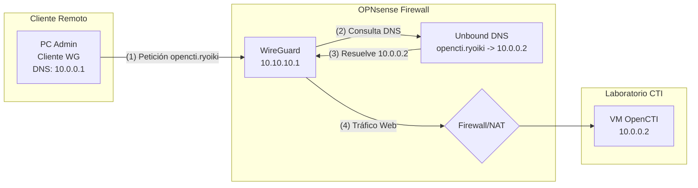

# Manual Técnico: Despliegue de OPNsense y VPN WireGuard
| **Variable**         | **Valor / Descripción**                                                        |
| :------------------- | :----------------------------------------------------------------------------- |
| **Plataforma**       | Proxmox VE                                                                     |
| **S.O. Guest**       | OPNsense (basado en FreeBSD)                                                   |
| **Servicio VPN**     | WireGuard                                                                      |
| **Red LAN**          | 10.0.0.0/24 (Laboratorio CTI)                                                  |
| **Túnel address WG** | 10.10.10.1/24                                                                  |
| **Objetivo**         | Proveer acceso remoto cifrado y seguro a la red ademas de actuar como firewall |

---
# Tabla de Contenidos

1. [Requisitos y Preparación de la VM](#1-requisitos)
2. [Instalación Base de OPNsense](#2-instalacion-base)
3. [Configuración Inicial de Red](#3-configuracion-red)
4. [Instalación y Configuración de WireGuard](#4-configuracion-wireguard)
    - [4.1 Habilitar el Servicio](#41-habilitar-servicio)
    - [4.2 Configurar la Instancia Local (Servidor)](#42-instancia-local)
    - [4.3 Configurar los Peers (Clientes)](#43-configurar-peers)
5. [Reglas de Firewall y NAT](#5-reglas-firewall)
    - [5.1 Alias dinámico Bloqueo_SOAR y regla asociada](#51-alias-dinámico-bloqueo_soar-y-regla-asociada)
6. [Configuración del Cliente (Ejemplo)](#6-configuracion-cliente)
7. [DNS-Override](#7-DNS-Override)
8. [Arquitectura](#8-diagrama-arquitectura)
---

## 1. Requisitos y Preparación de la VM <a id="1-requisitos"></a>
 **Dimensionamiento del Firewall**

OPNsense actuará como el router perimetral y servidor VPN de la infraestructura.

| Recurso        | Recomendado (Laboratorio) | Notas Proxmox                                                                    |
| :------------- | :------------------------ | :------------------------------------------------------------------------------- |
| **vCPU**       | 2 Cores                   | Tipo de CPU: `host` para mejor cifrado (AES-NI).                                 |
| **RAM**        | 2 GiB                     | Suficiente para enrutamiento y WireGuard.                                        |
| **Disco**      | 25 GB                     | Tipo de bus: `VirtIO Block`.                                                     |
| **Red (NICs)** | 2 Interfaces              | `net0` (WAN/Bridge Externo), `net1` (LAN/Bridge Interno). Modelo: `intel E1000`. |


- [x] Descargar la imagen ISO de OPNsense (arquitectura amd64, versión `dvd`).
- [x] Crear VM en Proxmox adjuntando las dos interfaces de red.

---

## 2. Instalación Base de OPNsense <a id="2-instalacion-base"></a>
 **Proceso de instalación del SO**

1. Arrancar la VM con la ISO montada.
2. Esperar al prompt de login (Live CD).
3. **Credenciales por defecto:**
   - Usuario: `installer`
   - Contraseña: `opnsense`
1. Seguir el asistente gráfico (bsdinstall):
   - [x] Seleccionar mapa de teclado (Spanish/ES).
   - [x] **Install (UFS/ZFS):** Para VMs, ZFS es ideal si Proxmox no gestiona el almacenamiento, de lo contrario UFS (Auto) es más ligero.
   - [x] Finalizar instalación, desmontar la ISO y reiniciar.

---

## 3. Configuración Inicial de Red <a id="3-configuracion-red"></a>
 **Asignación de Interfaces vía CLI**

Tras reiniciar, inicia sesión con `root` y contraseña `opnsense`. Aparecerá el menú de consola.

- [x] Seleccionar la opción `1) Assign interfaces`.
- [x] ¿Configurar LAGGs? `No`.
- [x] ¿Configurar VLANs? `No`.
- [x] Asignar **WAN**: Seleccionar la interfaz correspondiente (ej. `em0`).
- [x] Asignar **LAN**: Seleccionar la interfaz correspondiente (ej. `em1`).
- [x] Presionar `y` para aplicar.
- [x] Seleccionar la opción `2) Set interface IP address` para configurar la LAN (Ej: `10.0.0.1/24`).

> **Nota para el TFG:** A partir de este momento, la configuración se realiza desde el navegador web accediendo a `https://10.0.0.1` desde una máquina en la red LAN. Se recomienda crear una VM ligera dedicada a esta tarea, por ejemplo con una distribución como Lubuntu, ya que solo se usará hasta tener la VPN configurada.

---

## 4. Instalación y Configuración de WireGuard <a id="4-configuracion-wireguard"></a>

### 4.1 Habilitar el Servicio <a id="41-habilitar-servicio"></a>
En versiones recientes de OPNsense, el plugin puede venir instalado. Si no:
- [x] Ir a **System > Firmware > Plugins**.
- [x] Buscar e instalar `os-wireguard`.
- [x] Ir a **VPN > WireGuard > Settings** y marcar `Enable WireGuard`.


**Fundamento Criptográfico (Cryptokey Routing)** A diferencia de otras VPNs que usan certificados complejos, WireGuard se basa en un concepto muy simple inspirado en SSH: **el intercambio de claves asimétricas (Curva Elíptica 25519)**.
Para que un túnel se levante, la confianza debe ser mutua y estar preconfigurada: 
1. **El Servidor (OPNsense) necesita conocer al Cliente:** Para autorizar la conexión de un dispositivo, debemos crear un "Peer" en OPNsense e introducir explícitamente la **clave pública del cliente**. Si la clave no está registrada, el firewall descartará los paquetes silenciosamente. 
2. **El Cliente necesita conocer al Servidor:** El archivo de configuración del cliente debe contener la **clave pública del servidor OPNsense** para saber que se está conectando al endpoint legítimo y poder cifrar el tráfico de ida. Por tanto, el paso crítico de la configuración consiste en intercambiar y registrar las claves públicas de ambos extremos.

### 4.2 Configurar la Instancia Local (Servidor) <a id="42-instancia-local"></a>
- [x] Ir a **VPN > WireGuard > Local**.
- [x] Clic en el botón `+` para añadir.

| Parámetro                | Valor de Configuración                              |
| :----------------------- | :-------------------------------------------------- |
| **Name**                 | `VPN_nexus`                                         |
| **Public / Private Key** | *Hacer clic en el icono del engranaje para generar* |
| **Listen Port**          | `51820` (Puerto por defecto)                        |
| **Tunnel Address**       | `10.10.10.1/24` (Rango exclusivo para la VPN)       |
| **Peers**                | *Dejar en blanco por ahora*                         |

- [x] Guardar y aplicar cambios (`Apply`).

### 4.3 Configurar los Peers (Clientes) <a id="43-configurar-peers"></a>
- [x] Ir a **VPN > WireGuard > Endpoints** (o Peers).
- [x] Clic en el botón `+`.

| Parámetro       | Valor de Configuración                                        |
| :-------------- | :------------------------------------------------------------ |
| **Name**        | `Cliente_Admin_1`(Para identificar el equipo)                 |
| **Public Key**  | *[Pegar aquí la clave pública generada en el PC del cliente]* |
| **Allowed IPs** | `10.10.10.2/32` (IP estática asignada a este cliente)         |

- [x] Volver a **VPN > WireGuard > instances**, editar `VPN_nexus` y añadir este peer en el campo **Peers**.
- [x] Guardar y aplicar.

---

## 5. Reglas de Firewall y NAT <a id="5-reglas-firewall"></a>

**Permitir el tráfico de la VPN**

Para que el túnel funcione, hay que abrir puertos y permitir enrutamiento.

**Paso 1: Abrir el puerto en la WAN**
- [x] Ir a **Firewall > Rules > WAN**.
- [x] Crear nueva regla:
  - **Action:** Pass
  - **Interface:** WAN
  - **Direction:** IN
  - **Protocol:** UDP
  - **Destination:** any
  - **Destination port range:** `51820` to `51820`
  - **Description:** `Allow WireGuard Inbound`(O la que quieras que permita identificar para que es)


**Paso 2: Permitir tráfico de los clientes WireGuard hacia el firewall y la LAN** 
- [x] Ir a **Firewall > Rules > WireGuard** (esta pestaña aparece automáticamente al habilitar el plugin). 
- [x] Crear nueva regla: 
- **Action:** Pass 
- **Interface:** WireGuard 
- **Direction:** IN 
- **Protocol:** any 
- **Source:** Single host or alias → WireGuard net (`10.10.10.0/24`) 
- **Destination:** This Firewall, LAN net 
- **Destination port range:** any 
- **Description:** `Allow traffic from WireGuard clients to firewall and LAN` Esta regla autoriza al cliente VPN administrativo a alcanzar tanto la propia interfaz de gestión del firewall (consola web `https://10.0.0.1`, SSH al firewall) como cualquier servicio expuesto en la red del laboratorio (consolas web de OpenCTI, Wazuh, n8n y SSH a las VMs internas). El alcance se restringe deliberadamente al rango interno de WireGuard (`10.10.10.0/24`) para que la regla solo surta efecto cuando el tráfico procede del túnel autenticado y no de otro origen.

---

## 5.1 Alias dinámico `Bloqueo_SOAR` y regla asociada

Una de las funciones que justifican la elección de OPNsense en el cap. 3.2.4 de la memoria es su capacidad nativa para gestionar *aliases* alimentados dinámicamente desde fuentes externas. Esta capacidad se aprovecha aquí para crear un alias `Bloqueo_SOAR` que el flujo SOAR de n8n actualiza en tiempo real con las direcciones IP que deben quedar bloqueadas perimetralmente.

### Creación del alias

- [x] Ir a **Firewall > Aliases**.
- [x] Clic en `+` para añadir un alias nuevo.

| Parámetro       | Valor de Configuración                                              |
| :-------------- | :------------------------------------------------------------------ |
| **Enabled**     | ✅ Marcado                                                          |
| **Name**        | `Bloqueo_SOAR`                                                      |
| **Type**        | `Host(s)`                                                           |
| **Description** | `IPs bloqueadas dinámicamente por el flujo SOAR (n8n / Wazuh)`     |
| **Content**     | *(vacío inicialmente; se alimenta vía API desde n8n)*               |

- [x] Guardar y aplicar cambios.

### Regla de firewall que consume el alias

Una vez creado el alias, se necesita una regla de firewall que bloquee todo el tráfico cuyo origen coincida con cualquier IP listada en `Bloqueo_SOAR`.

- [x] Ir a **Firewall > Rules > WAN**.
- [x] Crear nueva regla **al inicio del listado** (la prioridad importa: las reglas se evalúan de arriba abajo y la primera coincidencia gana).

| Parámetro                    | Valor de Configuración                          |
| :--------------------------- | :---------------------------------------------- |
| **Action**                   | `Block`                                         |
| **Interface**                | `WAN`                                           |
| **Direction**                | `IN`                                            |
| **Protocol**                 | `any`                                           |
| **Source**                   | `Single host or alias` → `Bloqueo_SOAR`         |
| **Destination**              | `any`                                           |
| **Description**              | `Block traffic from IPs reported by SOAR`       |
| **Log**                      | ✅ Marcado (para auditoría de bloqueos)         |

- [x] Guardar y aplicar.

### Cómo se actualiza el alias desde n8n

El subworkflow `BlockIP-TOOL` del flujo SOAR realiza una petición autenticada contra la API REST de OPNsense (`/api/firewall/alias_util/add/Bloqueo_SOAR`) cada vez que el flujo decide bloquear una IP. La operación es atómica: la IP se añade al alias en memoria y la lista queda activa de inmediato sin necesidad de recargar reglas. La documentación detallada del subworkflow se encuentra en el anexo **Workflow SOAR**.

### Verificación

Para comprobar el contenido del alias en cualquier momento:

- [x] Ir a **Firewall > Diagnostics > Aliases**.
- [x] Buscar `Bloqueo_SOAR` en el listado y desplegarlo para ver las IPs activas.

Como alternativa por línea de comandos desde la consola del firewall:

```bash
pfctl -t Bloqueo_SOAR -T show
```

---

## 6. Configuración del Cliente (Ejemplo Windows/Linux) <a id="6-configuracion-cliente"></a>
 **Archivo `wg0.conf` para el cliente**

En la máquina remota del administrador (tu PC local), crea este archivo de configuración en el cliente de WireGuard (Tienes que tener instalado wireguard):

```ini
[Interface]
# Clave privada generada en el PC del cliente
PrivateKey = <CLAVE_PRIVADA_DEL_CLIENTE>
Address = 10.10.10.2/32
DNS = 10.0.0.1  # IP LAN de OPNsense

[Peer]
# Clave pública copiada desde la instancia creada anteriormente
PublicKey = <CLAVE_PUBLICA_DEL_SERVIDOR_OPNSENSE>
# IP Pública de tu router / OPNsense
Endpoint = IP_PUBLICA_O_DDNS:51820
# Redes a las que se puede acceder por la VPN (10.0.0.0/24 es el lab)
AllowedIPs = 10.0.0.0/24, 10.10.10.0/24
PersistentKeepalive = 25
```

## 7. DNS Override  <a id="7-DNS-Override"></a>

> [!WARNING]
> **Aviso sobre TLDs (*Top-Level Domains*): el problema del dominio `.nexus`**
>
> Durante la fase de diseño se debe evitar el uso de dominios como `.nexus` (ej. `opencti.nexus`) para entornos de laboratorio locales. El dominio `.nexus` es un dominio oficial de Internet (gTLD) incluido en la lista de precarga **HSTS (*HTTP Strict Transport Security*)**.
>
> Esta directiva obliga a los navegadores web modernos a requerir exclusivamente conexiones seguras mediante certificados HTTPS válidos y emitidos por entidades certificadoras públicas. Como consecuencia, cualquier intento de acceder a un servicio local configurado con HTTP estándar (o con certificados autofirmados que no coincidan) será bloqueado automáticamente e irrevocablemente por el navegador.
>
> **Solución:** utilizar dominios reservados para uso privado, como `.home.arpa` (RFC 8375), `.internal` (reservado por ICANN en 2024 para uso privado) o `.test` (RFC 2606), o un dominio inventado que no colisione con ningún gTLD existente. En este laboratorio se optó por `.ryoiki`, descrito a continuación.

**Configuración en OPNsense:** 
- [x] Ir a **Services > Unbound DNS > Overrides**.
- [x] En la pestaña **Host Overrides**, hacer clic en `+`. 
- [x] Configurar los siguientes campos: 
- **Host:** `opencti` (El nombre de la máquina). 
- **Domain:** `ryoiki` (El dominio local seguro elegido). 
- **IP:** `10.0.0.2` (La IP real del servidor OpenCTI en la LAN). 
- **Description:** `Algo indentificativo`. 
- [x] Guardar y aplicar cambios. *(Ahora la URL de acceso será `http://opencti.ryoiki:8080` o `https://opencti.ryoiki`)*.


## 8. Arquitectura<a id="8-diagrama-arquitectura"></a>



