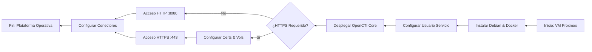

# 🛠️ Manual Técnico: Despliegue de OpenCTI en Proxmox
| **Variable**   | **Valor / Descripción**                                  |
| :------------- | :------------------------------------------------------- |
| **Plataforma** | Proxmox VE                                               |
| **S.O. Guest** | Debian 13.2.0 (amd64 netinst/small)                      |
| **Despliegue** | Docker & Docker Compose                                  |
| **Database**   | ElasticSearch + Redis + MinIO                            |
| **Objetivo**   | Despliegue de plataforma Cyber Threat Intelligence (CTI) |

---

## 📑 Tabla de Contenidos
1. [Requisitos del Sistema](#1-requisitos-del-sistema)
2. [Creación y Configuración de la VM](#2-creación-y-configuración-de-la-vm)
3. [Instalación del Sistema Operativo](#3-instalación-del-sistema-operativo)
4. [Instalación de OpenCTI](#4-instalación-de-opencti)
5. [Configuración de Conectores (AlienVault)](#5-configuración-de-conectores-alienvault)
6. [Mantenimiento y Actualización](#6-mantenimiento-y-actualización)
7. [Securización: OpenCTI sobre TLS](#7-securización-opencti-sobre-tls)

---

## 1. Requisitos del Sistema
Antes de iniciar, confirmar disponibilidad de recursos en el nodo Proxmox:

| Recurso   | Recomendado (Doc) | Configuración Autor | Configuración Final |
| :-------- | :---------------- | :------------------ | ------------------- |
| **vCPU**  | 6 Cores           | **8 Cores**         | **10 Cores**        |
| **RAM**   | 16 GiB            | **16 GiB**          | **40 GiB**          |
| **Disco** | >32 GB            | **128 GB**          | **300 GB**          |

- [x] Descargar ISO: **Debian amd64 small/netinst**.

---

## 2. Creación y Configuración de la VM
- [x] Crear VM en Proxmox con los recursos definidos en la tabla anterior.
- [x] Adjuntar la ISO de Debian.
- [x] Configurar interfaz de red (Bridge) y VLANs según arquitectura.

---

## 3. Instalación del Sistema Operativo en la maquina de Open CTI
Pasos críticos durante la instalación de Debian:

- [x] **Configuración Regional:** Idioma, ubicación y teclado.
- [ ] **Red:** Dominio local (ej. `home.lab` o dejar en blanco).
- [x] **Usuarios:**
    - `root`: Establecer contraseña robusta.
    - Usuario no-root: Crear usuario (ej. `manu`) y contraseña para entrada por ssh.
- [x] **Particionamiento:** Usar disco completo.
### 3.1 Post-Creación VM: Habilitar Sudo
Si el comando `sudo` no viene preinstalado o configurado:

```bash
# 1. Acceder como root
su root

# 2. Actualizar repositorios e instalar sudo
apt clean && apt update && apt upgrade -y && apt install -y sudo

# 3. Añadir usuario al grupo sudo
/usr/sbin/usermod -a -G sudo <tu_usuario_no_root>

# 4. Arreglar PATH para sbin
echo 'export PATH=/usr/sbin:$PATH' >> ~/.bashrc

# 5. Salir y re-loguear con el usuario no-root y volver a ejecutar
exit
echo 'export PATH=/usr/sbin:$PATH' >> ~/.bashrc
```

## 4. Instalación de OpenCTI

### 4.1 Preparación del Entorno
- [x] **Crear usuario de servicio:**
```bash
sudo useradd -r -s /bin/bash -m -d /opt/opencti opencti_svc
sudo passwd opencti_svc
```

#### Ajuste de `vm.max_map_count` para Elasticsearch

  Qué es `vm.max_map_count`
  
- Controla el **número máximo de áreas de memoria mapeadas** (`mmap`) por proceso en Linux.
- Elasticsearch usa muchas áreas de memoria debido a:

  - Índices de Lucene
  - Buffers internos
  - Multihilo y shards

- Si el valor es demasiado bajo, el nodo **no arrancará** y mostrará errores como:
	- `max virtual memory areas vm.max_map_count [65530] is too low, increase to at least [262144]` 

---

#### Recomendación oficial de Elasticsearch

- Elasticsearch recomienda **vm.max_map_count = 262144** como valor mínimo para nodos grandes.
- Este valor permite:
  - Heap de 32–64 GB
  - Múltiples índices y shards
  - Evitar errores de “too many memory mapped areas”

**Referencia:** [Elastic Docs – Linux Virtual Memory Settings](https://www.elastic.co/guide/en/elasticsearch/reference/current/vm-max-map-count.html)

```bash
sudo sysctl -w vm.max_map_count=262144
echo 'vm.max_map_count=262144' | sudo tee --append /etc/sysctl.conf
```

### 4.2 Instalación de Docker Engine

- [ ] Instalar Docker:

```Bash
sudo apt install -y ca-certificates curl gnupg lsb-release
sudo mkdir -p /etc/apt/keyrings
curl -fsSL https://download.docker.com/linux/debian/gpg | sudo gpg --dearmor -o /etc/apt/keyrings/docker.gpg
echo "deb [arch=$(dpkg --print-architecture) signed-by=/etc/apt/keyrings/docker.gpg] https://download.docker.com/linux/debian $(lsb_release -cs) stable" | sudo tee /etc/apt/sources.list.d/docker.list > /dev/null
sudo apt update && sudo apt install -y docker-ce docker-ce-cli containerd.io docker-compose-plugin docker-compose
sudo systemctl enable --now docker
sudo usermod -a -G docker opencti_svc
```


# 📊  Diagrama de Flujo instalación mínima operativa

