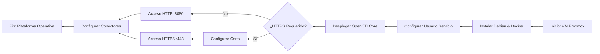

# 🛠️ Manual Técnico: Despliegue de OpenCTI en Proxmox
| **Variable**   | **Valor / Descripción**                                  |
| :------------- | :------------------------------------------------------- |
| **Plataforma** | Proxmox VE                                               |
| **S.O. Guest** | Debian 13.2.0 (amd64 netinst/small)                      |
| **Despliegue** | Docker & Docker Compose                                  |
| **Database**   | ElasticSearch + Redis + MinIO                            |
| **Objetivo**   | Despliegue de plataforma Cyber Threat Intelligence (CTI) |

---

## 📑 Tabla de Contenidos


---

## 1. Requisitos del Sistema
Antes de iniciar, confirmar disponibilidad de recursos en el nodo Proxmox:

| Recurso   | Recomendado (Doc) | Configuración Autor | Configuración Final |
| :-------- | :---------------- | :------------------ | ------------------- |
| **vCPU**  | 6 Cores           | **8 Cores**         | **10 Cores**        |
| **RAM**   | 16 GiB            | **16 GiB**          | **40 GiB**          |
| **Disco** | >32 GB            | **128 GB**          | **300 GB**          |

- [x] Descargar ISO: **Debian amd64 small/netinst**.

---

## 2. Creación y Configuración de la VM
- [x] Crear VM en Proxmox con los recursos definidos en la tabla anterior.
- [x] Adjuntar la ISO de Debian.
- [x] Configurar interfaz de red (Bridge) y VLANs según arquitectura.

---

## 3. Instalación del Sistema Operativo en la maquina de Open CTI
Pasos críticos durante la instalación de Debian:

- [x] **Configuración Regional:** Idioma, ubicación y teclado.
- [ ] **Red:** Dominio local (ej. `home.lab` o dejar en blanco).
- [x] **Usuarios:**
    - `root`: Establecer contraseña robusta.
    - Usuario no-root: Crear usuario (ej. `manu`) y contraseña para entrada por ssh.
- [x] **Particionamiento:** Usar disco completo.
### 3.1 Post-Creación VM: Habilitar Sudo
Si el comando `sudo` no viene preinstalado o configurado:

```bash
# 1. Acceder como root
su root

# 2. Actualizar repositorios e instalar sudo
apt clean && apt update && apt upgrade -y && apt install -y sudo

# 3. Añadir usuario al grupo sudo
/usr/sbin/usermod -a -G sudo <tu_usuario_no_root>

# 4. Arreglar PATH para sbin
echo 'export PATH=/usr/sbin:$PATH' >> ~/.bashrc

# 5. Salir y re-loguear con el usuario no-root y volver a ejecutar
exit
echo 'export PATH=/usr/sbin:$PATH' >> ~/.bashrc
```

## 4. Instalación de OpenCTI

### 4.1 Preparación del Entorno
- [x] **Crear usuario de servicio:**
```bash
sudo useradd -r -s /bin/bash -m -d /opt/opencti opencti_svc
sudo passwd opencti_svc
```

#### Ajuste de `vm.max_map_count` para Elasticsearch

  Qué es `vm.max_map_count`
  
- Controla el **número máximo de áreas de memoria mapeadas** (`mmap`) por proceso en Linux.
- Elasticsearch usa muchas áreas de memoria debido a:

  - Índices de Lucene
  - Buffers internos
  - Multihilo y shards

- Si el valor es demasiado bajo, el nodo **no arrancará** y mostrará errores como:
	- `max virtual memory areas vm.max_map_count [65530] is too low, increase to at least [262144]` 

---

#### Recomendación oficial de Elasticsearch

- Elasticsearch recomienda **vm.max_map_count = 262144** como valor mínimo para nodos grandes.
- Este valor permite:
  - Heap de 32–64 GB
  - Múltiples índices y shards
  - Evitar errores de “too many memory mapped areas”
  
Aunque mas tarde le demos solo **10 GB** en las variables de entorno

**Referencia:** [Elastic Docs – Linux Virtual Memory Settings](https://www.elastic.co/guide/en/elasticsearch/reference/current/vm-max-map-count.html)

```bash
sudo sysctl -w vm.max_map_count=262144
echo 'vm.max_map_count=262144' | sudo tee --append /etc/sysctl.conf
```

### 4.2 Instalación de Docker Engine

- [x] Instalar Docker:

```Bash
sudo apt install -y ca-certificates curl gnupg lsb-release
sudo mkdir -p /etc/apt/keyrings
curl -fsSL https://download.docker.com/linux/debian/gpg | sudo gpg --dearmor -o /etc/apt/keyrings/docker.gpg
echo "deb [arch=$(dpkg --print-architecture) signed-by=/etc/apt/keyrings/docker.gpg] https://download.docker.com/linux/debian $(lsb_release -cs) stable" | sudo tee /etc/apt/sources.list.d/docker.list > /dev/null
sudo apt update && sudo apt install -y docker-ce docker-ce-cli containerd.io docker-compose-plugin docker-compose
sudo systemctl enable --now docker
sudo usermod -a -G docker opencti_svc
```
### 4.3 Despliegue del Stack

Trabajar como el usuario de servicio: `su opencti_svc` (Directorio `/opt/opencti`).

1. **Descargar Docker Compose:**

```bash
wget [https://github.com/OpenCTI-Platform/docker/raw/master/docker-compose.yml](https://github.com/OpenCTI-Platform/docker/raw/master/docker-compose.yml) -O docker-compose.yml
```

2. **Variables de entorno**
```env
CONNECTOR_EXPORT_FILE_CSV_ID=<UUID> #tambien $(cat /proc/sys/kernel/random/uuid)  ! esto cambia los uuids si se vuelve a composear
CONNECTOR_EXPORT_FILE_STIX_ID=<UUID> #tambien $(cat /proc/sys/kernel/random/uuid)  ! esto cambia los uuids si se vuelve a composear
CONNECTOR_HISTORY_ID=<UUID> #tambien $(cat /proc/sys/kernel/random/uuid)  ! esto cambia los uuids si se vuelve a composear
CONNECTOR_IMPORT_FILE_STIX_ID=<UUID> #tambien $(cat /proc/sys/kernel/random/uuid)  ! esto cambia los uuids si se vuelve a composear
CONNECTOR_IMPORT_REPORT_ID=<UUID> #tambien $(cat /proc/sys/kernel/random/uuid)  ! esto cambia los uuids si se vuelve a composear
ELASTIC_MEMORY_SIZE=10G
MINIO_ROOT_PASSWORD=<UUID> #tambien $(cat /proc/sys/kernel/random/uuid)  ! esto cambia los uuids si se vuelve a composear
MINIO_ROOT_USER=<UUID> #tambien $(cat /proc/sys/kernel/random/uuid)  ! esto cambia los uuids si se vuelve a composear
OPENCTI_ADMIN_EMAIL=<email que quieras>
OPENCTI_ADMIN_PASSWORD=<contraseña que quieras>
OPENCTI_ADMIN_TOKEN=<UUID>
OPENCTI_BASE_URL=http://ip-de-la-maquina
RABBITMQ_DEFAULT_PASS=guest
RABBITMQ_DEFAULT_USER=guest
SMTP_HOSTNAME=opencti #tambien $(hostname)
```
3. **Configuración final**
	- [x] Editar `.env` (`nano .env`) y actualizar:
	- `OPENCTI_ADMIN_EMAIL`
	- `OPENCTI_ADMIN_PASSWORD`
	- `OPENCTI_BASE_URL`


4. **Lanzar Servicio**

```Bash
docker-compose up -d
```

> [!IMPORTANT]
>En este punto no hay conectores ni información pero queremos ver si va asi que crearemos túneles usando **`termius`** pasando por la maquina **`router`** previamente configurada, tambien se puede hacer con la terminal local con un correcto funcionamiento del uso de claves *`publicas-privadas`* y configuración del archivo *`config`* de ssh, a continuación se explica la manera manual, termius es muy intuitivo

> [!NOTE]  
> Configurar segun ips o nombres de host propios


```powershell
ssh-keygen -t rsa -b 4096
```
-  Esta clave la tenemos que enviar a nuestro lugar al que queremos conectarnos
```powershell
ssh-copy-id usuario@ip_nic_externa_router
```
- Esto crea `~/.ssh` en el servidor si no existe y añade la clave a `~/.ssh/authorized_keys`
### ``C:\Users\user\.ssh\config``

```bash
# para conectarse al router y reglas de enrutamiento
```

Host routertfg
  HostName ``ip-nic-externa-router``
  User  ``user``
  IdentityFile ~/.ssh/id_ed25519
  
```bash
# para port forwarding
```

  LocalForward 2222 79.137.70.95:8006
  LocalForward 3336 10.0.0.2:9200
  LocalForward 3334 10.0.0.2:8080
  LocalForward 3335 10.0.0.2:15672
  
```bash
# para usar cli de opencti
```
Host opencti
  HostName ``ip-opencti``
  User ``user``
  ProxyJump routertfg
```bash
# para usar cli del host proxmox
```
Host nexus
  HostName ``ip-publica-proxmox``
  User ``user``
  ProxyJump routertfg

```bash
# para usar sftp de opencti
```
Host opencti_svc
  HostName 10.0.0.2
  User opencti_svc
  ProxyJump routertfg
  IdentityFile ~/.ssh/id_ed25519

- Con la anterior configuración ya podremos escribir `ssh routertfg` y entraremos sin contraseña al router y se abriran los puertos para poder comprobar que **OpenCTI** esta funcionando, para entrar sin contraseña al resto de maquinas tendremos que copiar la clave publica a estas 

Con la configuración anterior podremos hacer en nuestro buscador local
```firefox
http://localhost:puerto_en_donde_tengamos_el_forward
```

Yo lo configure en el 3334, para el dashboard de opencti, los otros puertos 3335 y 3336 son para monitorizar rabbit por interfaz y ver configuraciones de la base de datos de elasticsearch

> [!WARNING]  
> Me quedo de momento por aqui, EXPLICAR AGREGACION DE CONECTORES OFICIALES
  
# 📊  Diagrama de Flujo instalación mínima operativa

