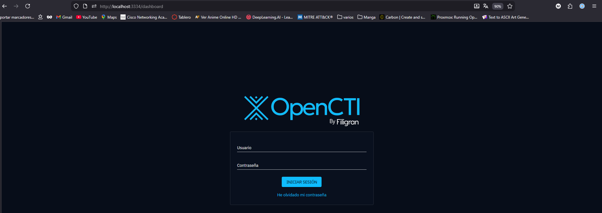
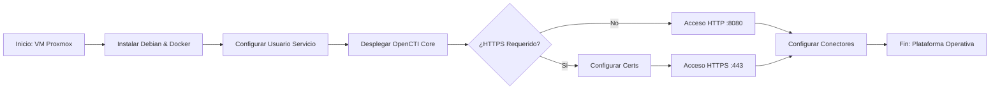

# 🛠️ Manual Técnico: Despliegue de OpenCTI en Proxmox
| **Variable**   | **Valor / Descripción**                                  |
| :------------- | :------------------------------------------------------- |
| **Plataforma** | Proxmox VE                                               |
| **S.O. Guest** | Debian 13.2.0 (amd64 netinst/small)                      |
| **Despliegue** | Docker & Docker Compose                                  |
| **Database**   | ElasticSearch + Redis + MinIO                            |
| **Objetivo**   | Despliegue de plataforma Cyber Threat Intelligence (CTI) |

---

## 1. Requisitos del Sistema
Antes de iniciar, confirmar disponibilidad de recursos en el nodo Proxmox:

| Recurso   | Recomendado (Doc) | Configuración Autor | Configuración Final |
| :-------- | :---------------- | :------------------ | ------------------- |
| **vCPU**  | 6 Cores           | **8 Cores**         | **10 Cores**        |
| **RAM**   | 16 GiB            | **16 GiB**          | **40 GiB**          |
| **Disco** | >32 GB            | **128 GB**          | **300 GB**          |

- [x] Descargar ISO: **Debian amd64 small/netinst**.

---

## 2. Creación y Configuración de la VM
- [x] Crear VM en Proxmox con los recursos definidos en la tabla anterior.
- [x] Adjuntar la ISO de Debian.
- [x] Configurar interfaz de red (Bridge) y VLANs según arquitectura.

---

## 3. Instalación del Sistema Operativo en la maquina de Open CTI
Pasos críticos durante la instalación de Debian:

- [x] **Configuración Regional:** Idioma, ubicación y teclado.
- [ ] **Red:** Dominio local (o dejar en blanco).
- [x] **Usuarios:**
    - `root`: Establecer contraseña robusta.
    - Usuario no-root: Crear usuario (ej. `manu`) y contraseña para entrada por ssh.
- [x] **Particionamiento:** Usar disco completo.
### 3.1 Post-Creación VM: Habilitar Sudo
Si el comando `sudo` no viene preinstalado o configurado:

```bash
# 1. Acceder como root
su root

# 2. Actualizar repositorios e instalar sudo
apt clean && apt update && apt upgrade -y && apt install -y sudo

# 3. Añadir usuario al grupo sudo
/usr/sbin/usermod -a -G sudo <tu_usuario_no_root>

# 4. Arreglar PATH para sbin
echo 'export PATH=/usr/sbin:$PATH' >> ~/.bashrc

# 5. Salir y re-loguear con el usuario no-root y volver a ejecutar
exit
echo 'export PATH=/usr/sbin:$PATH' >> ~/.bashrc
```

## 4. Instalación de OpenCTI

### 4.1 Preparación del Entorno
- [x] **Crear usuario de servicio:**
```bash
sudo useradd -r -s /bin/bash -m -d /opt/opencti opencti_svc
sudo passwd opencti_svc
```

#### Ajuste de `vm.max_map_count` para Elasticsearch

  Qué es `vm.max_map_count`
  
- Controla el **número máximo de áreas de memoria mapeadas** (`mmap`) por proceso en Linux.
- Elasticsearch usa muchas áreas de memoria debido a:

  - Índices de Lucene
  - Buffers internos
  - Multihilo y shards

- Si el valor es demasiado bajo, el nodo **no arrancará** y mostrará errores como:
	- `max virtual memory areas vm.max_map_count [65530] is too low, increase to at least [262144]` 

---

#### Recomendación oficial de Elasticsearch

- Elasticsearch recomienda **vm.max_map_count = 262144** como valor mínimo para nodos grandes.
- Este valor permite:
  - Heap de 32–64 GB
  - Múltiples índices y shards
  - Evitar errores de “too many memory mapped areas”
  
Aunque mas tarde le demos solo **10 GB** en las variables de entorno, esto es la memoria máxima que puede usar un proceso

**Referencia:** [Elastic Docs – Linux Virtual Memory Settings](https://www.elastic.co/guide/en/elasticsearch/reference/current/vm-max-map-count.html)

```bash
sudo sysctl -w vm.max_map_count=262144
echo 'vm.max_map_count=262144' | sudo tee --append /etc/sysctl.conf
```

### 4.2 Instalación de Docker Engine

- [x] Instalar Docker:

```Bash
sudo apt install -y ca-certificates curl gnupg lsb-release
sudo mkdir -p /etc/apt/keyrings
curl -fsSL https://download.docker.com/linux/debian/gpg | sudo gpg --dearmor -o /etc/apt/keyrings/docker.gpg
echo "deb [arch=$(dpkg --print-architecture) signed-by=/etc/apt/keyrings/docker.gpg] https://download.docker.com/linux/debian $(lsb_release -cs) stable" | sudo tee /etc/apt/sources.list.d/docker.list > /dev/null
sudo apt update && sudo apt install -y docker-ce docker-ce-cli containerd.io docker-compose-plugin docker-compose
sudo systemctl enable --now docker
sudo usermod -a -G docker opencti_svc
```
### 4.3 Despliegue del Stack

Trabajar como el usuario de servicio: `su opencti_svc` (Directorio `/opt/opencti`).

1. **Descargar Docker Compose:**

```bash
wget [https://github.com/OpenCTI-Platform/docker/raw/master/docker-compose.yml](https://github.com/OpenCTI-Platform/docker/raw/master/docker-compose.yml) -O docker-compose.yml
```

2. **Variables de entorno**
```env
CONNECTOR_EXPORT_FILE_CSV_ID=<UUID> #tambien $(cat /proc/sys/kernel/random/uuid)  ! esto cambia los uuids si se vuelve a composear
CONNECTOR_EXPORT_FILE_STIX_ID=<UUID> #tambien $(cat /proc/sys/kernel/random/uuid)  ! esto cambia los uuids si se vuelve a composear
CONNECTOR_HISTORY_ID=<UUID> #tambien $(cat /proc/sys/kernel/random/uuid)  ! esto cambia los uuids si se vuelve a composear
CONNECTOR_IMPORT_FILE_STIX_ID=<UUID> #tambien $(cat /proc/sys/kernel/random/uuid)  ! esto cambia los uuids si se vuelve a composear
CONNECTOR_IMPORT_REPORT_ID=<UUID> #tambien $(cat /proc/sys/kernel/random/uuid)  ! esto cambia los uuids si se vuelve a composear
ELASTIC_MEMORY_SIZE=10G
MINIO_ROOT_PASSWORD=<UUID> #tambien $(cat /proc/sys/kernel/random/uuid)  ! esto cambia los uuids si se vuelve a composear
MINIO_ROOT_USER=<UUID> #tambien $(cat /proc/sys/kernel/random/uuid)  ! esto cambia los uuids si se vuelve a composear
OPENCTI_ADMIN_EMAIL=<email que quieras>
OPENCTI_ADMIN_PASSWORD=<contraseña que quieras>
OPENCTI_ADMIN_TOKEN=<UUID>
OPENCTI_BASE_URL=http://ip-de-la-maquina
RABBITMQ_DEFAULT_PASS=guest
RABBITMQ_DEFAULT_USER=guest
SMTP_HOSTNAME=opencti #tambien $(hostname)
```
3. **Configuración final**
	- [x] Editar `.env` (`nano .env`) y actualizar:
	- `OPENCTI_ADMIN_EMAIL`
	- `OPENCTI_ADMIN_PASSWORD`
	- `OPENCTI_BASE_URL`


4. **Lanzar Servicio**

```Bash
docker-compose up -d
```
## 5. Configuración SSH

> [!IMPORTANT]
>En este punto no hay conectores ni información pero queremos ver si va asi que crearemos túneles usando **`termius`** pasando por la maquina **`router`** previamente configurada, tambien se puede hacer con la terminal local con un correcto funcionamiento del uso de claves *`publicas-privadas`* y configuración del archivo *`config`* de ssh, a continuación se explica la manera manual, termius es muy intuitivo

> [!NOTE]  
> Configurar segun ips o nombres de host propios


```powershell
ssh-keygen -t rsa -b 4096
```
-  Esta clave la tenemos que enviar a nuestro lugar al que queremos conectarnos
```powershell
ssh-copy-id usuario@ip_nic_externa_router
```
- Esto crea `~/.ssh` en el servidor si no existe y añade la clave a `~/.ssh/authorized_keys`
### ``C:\Users\user\.ssh\config``

```bash
# para conectarse al router y reglas de enrutamiento
```

Host routertfg </br>
  &ensp; HostName ``ip-nic-externa-router``</br>
  &ensp; User  ``user``</br>
  &ensp; IdentityFile ~/.ssh/id_ed25519</br>
  
```bash
# para port forwarding
```

  &ensp; LocalForward 2222 79.137.70.95:8006</br>
  &ensp; LocalForward 3336 10.0.0.2:9200</br>
  &ensp; LocalForward 3334 10.0.0.2:8080</br>
  &ensp; LocalForward 3335 10.0.0.2:15672</br>
  
```bash
# para usar cli de opencti
```
Host opencti</br>
  &ensp; HostName ``ip-opencti``</br>
  &ensp; User ``user``</br>
  &ensp; ProxyJump routertfg</br>
```bash
# para usar cli del host proxmox
```
Host nexus</br> 
  &ensp; HostName ``ip-publica-proxmox``</br>
  &ensp; User ``user``</br>
  &ensp; ProxyJump routertfg</br>

```bash
# para usar sftp de opencti
```
Host opencti_svc</br>
  &ensp; HostName 10.0.0.2</br>
  &ensp; User opencti_svc</br>
  &ensp; ProxyJump routertfg</br>
  &ensp; IdentityFile ~/.ssh/id_ed25519</br>

- Con la anterior configuración ya podremos escribir `ssh routertfg` y entraremos sin contraseña al router y se abriran los puertos para poder comprobar que **OpenCTI** esta funcionando, para entrar sin contraseña al resto de maquinas tendremos que copiar la clave publica a estas 

Con la configuración anterior podremos hacer en nuestro buscador local
```firefox
http://localhost:puerto_en_donde_tengamos_el_forward
```

Yo lo configure en el 3334, para el dashboard de opencti, los otros puertos 3335 y 3336 son para monitorizar rabbit por interfaz y ver configuraciones de la base de datos de elasticsearch



> [!WARNING]  
> Me quedo de momento por aqui, EXPLICAR AGREGACION DE CONECTORES OFICIALES

## 6. Como añadir conectores

Para añadir conectores lo que deberemos hacer es crear 1 usuario por cada conector que queramos añadir, asi sabremos que conector añade que información, para los conectores oficiales luego de crearles el usuario correspondiente en la plataforma
1. Parámetros
2. Seguridad
3. Usuarios
4. Crear Usuario
5. Rellenar según conveniencia
6. Añadir a Grupo conectores

Una vez creado el usuario en la plataforma para el conector que queramos deberemos añadir su bloque al docker-compose.yml (Aclarar que es posible tener el compose del Core y el de los conectores separados siempre que usen la misma red de Docker), para los oficiales, el bloque se encuentra en el repositorio oficial [RepoOpenCTI](https://github.com/OpenCTI-Platform/connectors/tree/master)

Para este ejemplo usare el conector de AlienVaultOTX

```yml
  connector-alienvault:
    image: opencti/connector-alienvault:6.9.6
    environment:
      # Conexión con el Core
      - OPENCTI_URL=http://opencti:8080
      - OPENCTI_TOKEN=${ALIENVAULT_USER_TOKEN}
      # Identidad del Conector
      - CONNECTOR_ID=${CONNECTOR_ALIENVAULT_ID}
      - CONNECTOR_NAME=AlienVault
      - CONNECTOR_SCOPE=alienvault
      - CONNECTOR_LOG_LEVEL=info
      - CONNECTOR_DURATION_PERIOD=PT30M
      # Configuración específica de AlienVault
      - ALIENVAULT_BASE_URL=https://otx.alienvault.com
      - ALIENVAULT_API_KEY=${ALIENVAULT_API_KEY}
      - ALIENVAULT_TLP=White
      - ALIENVAULT_CREATE_OBSERVABLES=true
      - ALIENVAULT_CREATE_INDICATORS=true
      # Importante: traerá datos desde el 1 de Enero de 2026 en adelante (Acordarme de cambiar esto a un script para ultimos 30 dias luego del primer import)
      - ALIENVAULT_PULSE_START_TIMESTAMP=2026-01-01T00:00:00
      - ALIENVAULT_REPORT_TYPE=threat-report
      - ALIENVAULT_REPORT_STATUS=New
      - ALIENVAULT_GUESS_MALWARE=false
      - ALIENVAULT_GUESS_CVE=false
      - ALIENVAULT_EXCLUDED_PULSE_INDICATOR_TYPES=FileHash-MD5,FileHash-SHA1
      - ALIENVAULT_ENABLE_RELATIONSHIPS=true
      - ALIENVAULT_ENABLE_ATTACK_PATTERNS_INDICATES=true
      - ALIENVAULT_FILTER_INDICATORS=false
      # Puntuaciones (Scoring)
      - ALIENVAULT_DEFAULT_X_OPENCTI_SCORE=50
      - ALIENVAULT_X_OPENCTI_SCORE_IP=60
      - ALIENVAULT_X_OPENCTI_SCORE_DOMAIN=70
      - ALIENVAULT_X_OPENCTI_SCORE_HOSTNAME=75
      - ALIENVAULT_X_OPENCTI_SCORE_EMAIL=70
      - ALIENVAULT_X_OPENCTI_SCORE_FILE=80
      - ALIENVAULT_X_OPENCTI_SCORE_URL=80
      - ALIENVAULT_X_OPENCTI_SCORE_MUTEX=60
      - ALIENVAULT_X_OPENCTI_SCORE_CRYPTOCURRENCY_WALLET=80
    restart: always
    # Conectamos este servicio a la red opencti_net
    networks:
      - opencti_net
```

Es importante que estos valores estén en nuestro .env anteriormente mencionado

${ALIENVAULT_USER_TOKEN} --> Es el Token de usuario que hay en el perfil del usuario del conector creado anteriormente
${CONNECTOR_ALIENVAULT_ID} --> Esto es un uuid que tendremos que generar
${ALIENVAULT_API_KEY} --> Esta es la API KEY del conector (Algunos conectores la exigen y habrá que obtenerla) [Link](https://otx.alienvault.com/api)

Una vez guardado los cambios en estos dos archivos, tendremos que reiniciar el docker-compose.yml (El de los conectores o el del core dependiendo de arquitectura)

```bash
#Para reiniciar
docker compose up -d
#para ver logs y asegurar funcionamiento, todo en la misma carpeta seria el NAME connector-alienvault 
docker logs -f NAME_DEL_CONECTOR
```

	1. OpenCTI
	2. Datos->Ingestión


# Diagrama de Flujo instalación mínima operativa (OpenCTI sin info)

