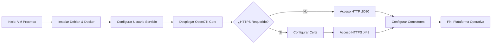

# Propósito y contexto

Este anexo documenta el despliegue de OpenCTI, el componente central de la arquitectura propuesta y el "cerebro" de la plataforma de ciberinteligencia desarrollada. Su rol arquitectónico se describe a alto nivel en el apartado 3.2.2 (OpenCTI) de la memoria, y los resultados de su operación se recogen en el apartado 3.6.2 (volumen de inteligencia gestionado: ~180.000 IoCs, ~1.570 muestras de malware, ~464 informes y ~325 conjuntos de intrusión).

## Arquitectura del despliegue

OpenCTI no es una aplicación monolítica, sino un ecosistema compuesto por varios servicios que se orquestan mediante Docker Compose:

| Componente              | Rol                                                                        | Imagen                           |
| :---------------------- | :------------------------------------------------------------------------- | :------------------------------- |
| **opencti-platform**    | Backend GraphQL y frontend React                                           | `opencti/platform:6.9.22`        |
| **opencti-worker** (x3) | Procesadores de las colas de RabbitMQ                                      | `opencti/worker:6.9.22`          |
| **elasticsearch**       | Almacenamiento e indexación de los objetos STIX                            | `elasticsearch:8.19.8`           |
| **redis**               | Caché de estado                                                            | `redis:8.4.0`                    |
| **minio**               | Almacenamiento de objetos (ficheros, exportaciones)                        | `minio/minio:RELEASE.2025-06-13` |
| **rabbitmq**            | *Broker* de mensajería entre conectores y workers                          | `rabbitmq:4.2-management`        |
| **xtm-composer**        | Gestor de integraciones (introducido en OpenCTI 6.x)                       | `filigran/xtm-composer:1.0.1`    |
| **rsa-key-generator**   | Genera la clave RSA que firma las comunicaciones internas del xtm-composer | `alpine/openssl:3.5.4`           |

Junto a estos servicios base, el Core integra una decena de **conectores internos oficiales** (export STIX/CSV/TXT, import file STIX, import document, import YARA, análisis de documentos, OpenCTI Datasets y MITRE ATT&CK) que vienen empaquetados en el `docker-compose.yml` descargado del repositorio oficial.

## Separación en dos *docker-compose*

El despliegue final del laboratorio mantiene **dos ficheros `docker-compose.yml` separados** ubicados en directorios distintos:

- **`/opt/opencti/docker-compose.yml`** — Core: base de datos, plataforma, workers y conectores internos oficiales.
- **`/opt/opencti/connectors/docker-compose.yml`** — Conectores externos: AlienVault OTX (oficial), Multi-Feed (propio), Gemini (propio) y Stream (propio).

Esta separación es deliberada y se justifica en el apartado 3.2.2.B de la memoria: cuando se modifica el código de un conector custom, interesa reiniciar únicamente esa capa sin tocar las bases de datos. Ambos *compose* comparten la misma red Docker (`opencti_net`), declarada como `external` en el segundo. El *script* `opencti-control` documentado en el anexo correspondiente automatiza el ciclo de vida coordinado de ambas capas.

---
#  Manual Técnico: Despliegue de OpenCTI en Proxmox
| **Variable**   | **Valor / Descripción**                                  |
| :------------- | :------------------------------------------------------- |
| **Plataforma** | Proxmox VE                                               |
| **S.O. Guest** | Debian 13.2.0 (amd64 netinst/small)                      |
| **Despliegue** | Docker & Docker Compose                                  |
| **Backend**    | ElasticSearch + Redis + MinIO                            |
| **Objetivo**   | Despliegue de plataforma Cyber Threat Intelligence (CTI) |


---

# Tabla de contenidos

1. [Requisitos del Sistema](#1-requisitos-del-sistema)
2. [Creación y Configuración de la VM](#2-creación-y-configuración-de-la-vm)
3. [Instalación del Sistema Operativo (Debian)](#3-instalación-del-sistema-operativo-en-la-maquina-de-open-cti)
    - [3.1 Post-Creación VM: Habilitar Sudo](#31-post-creación-vm-habilitar-sudo)
4. [Instalación de OpenCTI](#4-instalación-de-opencti)
    - [4.1 Preparación del Entorno](#41-preparación-del-entorno)
    - [4.2 Instalación de Docker Engine](#42-instalación-de-docker-engine)
    - [4.3 Despliegue del Stack](#43-despliegue-del-stack)
5. [Configuración SSH y Acceso Seguro](#5-configuración-ssh)
6. [Añadir y Configurar Conectores](#6-como-añadir-conectores)
7. [Diagrama de Flujo – Instalación Mínima Operativa](#diagrama-de-flujo-instalación-mínima-operativa-opencti-sin-info)

## 1. Requisitos del Sistema
Antes de iniciar, confirmar disponibilidad de recursos en el nodo Proxmox:

| Recurso   | Recomendado (Doc) | Configuración Final |
| :-------- | :---------------- | ------------------- |
| **vCPU**  | 6 Cores           | **10 Cores**        |
| **RAM**   | 16 GiB            | **40 GiB**          |
| **Disco** | >32 GB            | **300 GB**          |

- [x] Descargar ISO: **Debian amd64 small/netinst**.

---

## 2. Creación y Configuración de la VM
- [x] Crear VM en Proxmox con los recursos definidos en la tabla anterior.
- [x] Adjuntar la ISO de Debian.
- [x] Configurar interfaz de red (Bridge) y VLANs según arquitectura.

---

## 3. Instalación del Sistema Operativo en la máquina de OpenCTI
Pasos críticos durante la instalación de Debian:

- [x] **Configuración Regional:** Idioma, ubicación y teclado.
- [x] **Red:** Dominio local (o dejar en blanco).
- [x] **Usuarios:**
    - `root`: Establecer contraseña robusta.
    - Usuario no-root: Crear usuario (ej. `manu`) y contraseña para entrada por ssh.
- [x] **Particionamiento:** Usar disco completo.
### 3.1 Post-Creación VM: Habilitar Sudo
Si el comando `sudo` no viene preinstalado o configurado:

```bash
# 1. Acceder como root
su root

# 2. Actualizar repositorios e instalar sudo
apt clean && apt update && apt upgrade -y && apt install -y sudo

# 3. Añadir usuario al grupo sudo
/usr/sbin/usermod -a -G sudo <tu_usuario_no_root>

# 4. Arreglar PATH para sbin
echo 'export PATH=/usr/sbin:$PATH' >> ~/.bashrc

# 5. Salir y re-loguear con el usuario no-root y volver a ejecutar
exit
echo 'export PATH=/usr/sbin:$PATH' >> ~/.bashrc
```

## 4. Instalación de OpenCTI

### 4.1 Preparación del Entorno
- [x] **Crear usuario de servicio:**
```bash
sudo useradd -r -s /bin/bash -m -d /opt/opencti opencti_svc
sudo passwd opencti_svc
```

#### Ajuste de `vm.max_map_count` para Elasticsearch

  Qué es `vm.max_map_count`
  
- Controla el **número máximo de áreas de memoria mapeadas** (`mmap`) por proceso en Linux.
- Elasticsearch usa muchas áreas de memoria debido a:

  - Índices de Lucene
  - Buffers internos
  - Multihilo y shards

- Si el valor es demasiado bajo, el nodo **no arrancará** y mostrará errores como:
	- `max virtual memory areas vm.max_map_count [65530] is too low, increase to at least [262144]` 

---

#### Recomendación oficial de Elasticsearch

- Elasticsearch recomienda **vm.max_map_count = 262144** como valor mínimo para nodos grandes.
- Este valor permite:
  - Heap de 32–64 GB
  - Múltiples índices y shards
  - Evitar errores de “too many memory mapped areas”
  
Aunque mas tarde le demos solo **10 GB** en las variables de entorno, esto es la memoria máxima que puede usar un proceso

**Referencia:** [Elastic Docs – Linux Virtual Memory Settings](https://www.elastic.co/guide/en/elasticsearch/reference/current/vm-max-map-count.html)

```bash
sudo sysctl -w vm.max_map_count=262144
echo 'vm.max_map_count=262144' | sudo tee --append /etc/sysctl.conf
```

### 4.2 Instalación de Docker Engine

- [x] Instalar Docker:

```Bash
sudo apt install -y ca-certificates curl gnupg lsb-release
sudo mkdir -p /etc/apt/keyrings
curl -fsSL https://download.docker.com/linux/debian/gpg | sudo gpg --dearmor -o /etc/apt/keyrings/docker.gpg
echo "deb [arch=$(dpkg --print-architecture) signed-by=/etc/apt/keyrings/docker.gpg] https://download.docker.com/linux/debian $(lsb_release -cs) stable" | sudo tee /etc/apt/sources.list.d/docker.list > /dev/null
sudo apt update && sudo apt install -y docker-ce docker-ce-cli containerd.io docker-compose-plugin
sudo systemctl enable --now docker
sudo usermod -a -G docker opencti_svc
```
### 4.3 Despliegue del Stack

Trabajar como el usuario de servicio: `su opencti_svc` (Directorio `/opt/opencti`).

1. **Descargar Docker Compose:**

```bash
wget https://github.com/OpenCTI-Platform/docker/raw/master/docker-compose.yml -O docker-compose.yml
```

2. **Variables de entorno**
> **Generación de UUIDs:** muchas variables del `.env` (identificadores de conectores, tokens, credenciales de MinIO) requieren valores UUIDv4 válidos. Pueden generarse rápidamente mediante:
>
> ```bash
> cat /proc/sys/kernel/random/uuid
> ```
>
> **Importante:** una vez generado un UUID y desplegado el stack, **no debe cambiarse**. Los identificadores de los conectores se persisten en Elasticsearch y modificarlos provoca que OpenCTI los trate como conectores nuevos, generando duplicidades. Los UUIDs solo se regeneran al hacer un despliegue desde cero.

A continuación, el contenido base del fichero `.env`:

```env
# UUIDs de los conectores internos oficiales del Core
CONNECTOR_EXPORT_FILE_CSV_ID=<UUID>
CONNECTOR_EXPORT_FILE_STIX_ID=<UUID>
CONNECTOR_EXPORT_FILE_TXT_ID=<UUID>
CONNECTOR_IMPORT_FILE_STIX_ID=<UUID>
CONNECTOR_IMPORT_DOCUMENT_ID=<UUID>
CONNECTOR_IMPORT_FILE_YARA_ID=<UUID>
CONNECTOR_ANALYSIS_ID=<UUID>
CONNECTOR_IMPORT_EXTERNAL_REFERENCE_ID=<UUID>
CONNECTOR_OPENCTI_ID=<UUID>
CONNECTOR_MITRE_ID=<UUID>

# Identificador del nuevo gestor de integraciones (OpenCTI 6.x)
XTM_COMPOSER_ID=<UUID>

# Memoria asignada a Elasticsearch
ELASTIC_MEMORY_SIZE=10G

# Credenciales de MinIO (almacenamiento de objetos)
MINIO_ROOT_USER=<UUID>
MINIO_ROOT_PASSWORD=<UUID>

# Credenciales y configuración del usuario administrador inicial
OPENCTI_ADMIN_EMAIL=<email_administrador>
OPENCTI_ADMIN_PASSWORD=<contraseña_robusta>
OPENCTI_ADMIN_TOKEN=<UUID>

# URL pública de OpenCTI y datos de conexión
OPENCTI_HOST=<ip_de_la_maquina>
OPENCTI_PORT=8080
OPENCTI_EXTERNAL_SCHEME=http
OPENCTI_BASE_URL=http://<ip_de_la_maquina>
OPENCTI_HEALTHCHECK_ACCESS_KEY=<UUID>

# Credenciales de RabbitMQ (broker de mensajería)
RABBITMQ_DEFAULT_USER=guest
RABBITMQ_DEFAULT_PASS=guest

# Hostname para SMTP (puede ser el hostname del servidor: $(hostname))
SMTP_HOSTNAME=opencti
```

>[!NOTE]
> **Nota sobre `RABBITMQ_DEFAULT_USER/PASS`:** los valores `guest/guest` son aceptables en laboratorio pero **deben cambiarse** en cualquier entorno productivo, ya que son las credenciales por defecto conocidas públicamente.

3. **Configuración final**
	- [x] Editar `.env` (`nano .env`) y actualizar:
	- `OPENCTI_ADMIN_EMAIL`
	- `OPENCTI_ADMIN_PASSWORD`
	- `OPENCTI_BASE_URL`


4. **Lanzar Servicio**

```Bash
docker compose up -d
```
## 5. Configuración SSH y acceso seguro al laboratorio

> [!IMPORTANT]
> En este punto OpenCTI ya está arrancado pero todavía no es accesible desde el exterior porque la VM está aislada en la red `10.0.0.0/24`. Para validar que la plataforma funciona se establecen túneles SSH desde la máquina del administrador, pasando por la VM router previamente configurada (ver anexo *Configuración VM Router*). En el laboratorio se utilizó el cliente **Termius** por su gestión visual de túneles, pero la configuración manual mediante `~/.ssh/config` que se describe a continuación es funcionalmente equivalente.

### 5.1 Generación e intercambio de claves SSH

Desde la máquina del administrador, generar un par de claves (se usa ED25519 por ser más rápido y seguro que RSA con el mismo nivel de protección):

```bash
ssh-keygen -t ed25519 -C "admin@10.0.0.2"
```

Copiar la clave pública al servidor remoto:

```bash
ssh-copy-id usuario@<IP_NIC_EXTERNA_ROUTER>
```

Este comando crea `~/.ssh` en el servidor si no existe y añade la clave a `~/.ssh/authorized_keys`, permitiendo el acceso posterior sin contraseña.

### 5.2 Configuración del archivo `~/.ssh/config`

El archivo de configuración del cliente SSH centraliza todos los accesos al laboratorio. La ubicación del archivo varía según el sistema operativo:

- **Linux / macOS:** `~/.ssh/config`
- **Windows:** `C:\Users\<usuario>\.ssh\config`

A continuación se muestra la configuración completa utilizada en el laboratorio. Cada bloque `Host` representa un alias que se puede usar como `ssh <alias>`:

```ssh-config
# Acceso al router y túneles para validar OpenCTI desde el navegador local
Host routertfg
    HostName <IP_NIC_EXTERNA_ROUTER>
    User <usuario>
    IdentityFile ~/.ssh/id_ed25519
    # Túneles de port-forwarding
    LocalForward 2222 <IP_PUBLICA_PROXMOX>:8006   # Consola web Proxmox
    LocalForward 3334 10.0.0.2:8080                # Dashboard OpenCTI
    LocalForward 3335 10.0.0.2:15672               # Consola RabbitMQ
    LocalForward 3336 10.0.0.2:9200                # API Elasticsearch

# Acceso CLI a la VM OpenCTI saltando por el router
Host opencti
    HostName 10.0.0.2
    User <usuario>
    ProxyJump routertfg

# Acceso CLI al hipervisor Proxmox
Host nexus
    HostName <IP_PUBLICA_PROXMOX>
    User <usuario>
    ProxyJump routertfg

# Acceso SFTP a la VM OpenCTI como usuario de servicio
Host opencti_svc
    HostName 10.0.0.2
    User opencti_svc
    ProxyJump routertfg
    IdentityFile ~/.ssh/id_ed25519
```

> [!NOTE] 
> Sobre `ProxyJump`: la directiva `ProxyJump routertfg` indica a SSH que primero abra una conexión al host `routertfg` y, a través de ese túnel, alcance el host destino. Esto evita tener que copiar manualmente claves a las VMs internas y centraliza todo el acceso en una única entrada de configuración. Para que funcione sin contraseña en las VMs internas, su clave pública también debe estar en el `authorized_keys` de cada una.

### 5.3 Validación del acceso desde el navegador

Con la configuración anterior aplicada, basta con ejecutar:

```bash
ssh routertfg
```

para abrir simultáneamente la conexión al router y todos los túneles de port-forwarding declarados. A partir de ese momento, los servicios internos del laboratorio son accesibles desde el navegador local mediante:

| Puerto local                          | Servicio              | URL de acceso                   |
| :------------------------------------ | :-------------------- | :------------------------------ |
| `3334`                                | Dashboard OpenCTI     | `http://localhost:3334`         |
| `3335`                                | Consola RabbitMQ      | `http://localhost:3335`         |
| `3336`                                | API Elasticsearch     | `http://localhost:3336`         |
| `2222`                                | Consola web Proxmox   | `https://localhost:2222`        |


> [!NOTE]
> Esta configuración mediante túneles SSH cumplió su función durante la fase inicial del despliegue, antes de la incorporación de OPNsense y WireGuard al laboratorio. Una vez disponible la VPN, el acceso administrativo se sustituyó por el túnel WireGuard descrito en el anexo *OPNsense*, que permite alcanzar los servicios directamente por IP/FQDN sin necesidad de port-forwarding manual.

> [!WARNING]
> Durante la fase de pruebas se añadieron varios conectores adicionales que posteriormente se retiraron para no saturar el sistema. Al tratarse de un laboratorio con recursos limitados, el objetivo es disponer de un volumen relevante de información para validar los flujos, no maximizar la ingesta. Una sobrecarga de Elasticsearch llevaba al procesador del nodo Proxmox al límite y degradaba el resto de servicios. La estrategia final, descrita en el apartado 3.6.3 de la memoria, redujo el conjunto activo de conectores a AlienVault OTX y los conectores propios desarrollados.

---
## 6. Como añadir conectores

Para añadir conectores lo que deberemos hacer es crear 1 usuario por cada conector que queramos añadir, asi sabremos que conector añade que información; para los conectores oficiales luego de crear el usuario correspondiente en la plataforma:
1. Parámetros
2. Seguridad
3. Usuarios
4. Crear Usuario
5. Rellenar según conveniencia
6. Añadir a Grupo conectores

Una vez creado el usuario en la plataforma para el conector que queramos deberemos añadir su bloque al docker-compose.yml (Aclarar que es posible tener el compose del Core y el de los conectores separados siempre que usen la misma red de Docker), para los oficiales, el bloque se encuentra en el repositorio oficial [RepoOpenCTI](https://github.com/OpenCTI-Platform/connectors/tree/master)

Para este ejemplo usare el conector de AlienVaultOTX

```yml
  connector-alienvault:
    image: opencti/connector-alienvault:6.9.22
    environment:
      # Conexión con el Core
      - OPENCTI_URL=http://opencti:8080
      - OPENCTI_TOKEN=${ALIENVAULT_USER_TOKEN}
      # Identidad del Conector
      - CONNECTOR_ID=${CONNECTOR_ALIENVAULT_ID}
      - CONNECTOR_NAME=AlienVault
      - CONNECTOR_SCOPE=alienvault
      - CONNECTOR_LOG_LEVEL=info
      - CONNECTOR_DURATION_PERIOD=PT30M
      # Configuración específica de AlienVault
      - ALIENVAULT_BASE_URL=https://otx.alienvault.com
      - ALIENVAULT_API_KEY=${ALIENVAULT_API_KEY}
      - ALIENVAULT_TLP=White
      - ALIENVAULT_CREATE_OBSERVABLES=true
      - ALIENVAULT_CREATE_INDICATORS=true
      # Punto de partida de la ingesta: pulsos publicados desde el 1 de enero de 2026 en adelante
      - ALIENVAULT_PULSE_START_TIMESTAMP=2026-01-01T00:00:00
      - ALIENVAULT_REPORT_TYPE=threat-report
      - ALIENVAULT_REPORT_STATUS=New
      - ALIENVAULT_GUESS_MALWARE=false
      - ALIENVAULT_GUESS_CVE=false
      - ALIENVAULT_EXCLUDED_PULSE_INDICATOR_TYPES=FileHash-MD5,FileHash-SHA1
      - ALIENVAULT_ENABLE_RELATIONSHIPS=true
      - ALIENVAULT_ENABLE_ATTACK_PATTERNS_INDICATES=true
      - ALIENVAULT_FILTER_INDICATORS=false
      # Puntuaciones (Scoring)
      - ALIENVAULT_DEFAULT_X_OPENCTI_SCORE=50
      - ALIENVAULT_X_OPENCTI_SCORE_IP=60
      - ALIENVAULT_X_OPENCTI_SCORE_DOMAIN=70
      - ALIENVAULT_X_OPENCTI_SCORE_HOSTNAME=75
      - ALIENVAULT_X_OPENCTI_SCORE_EMAIL=70
      - ALIENVAULT_X_OPENCTI_SCORE_FILE=80
      - ALIENVAULT_X_OPENCTI_SCORE_URL=80
      - ALIENVAULT_X_OPENCTI_SCORE_MUTEX=60
      - ALIENVAULT_X_OPENCTI_SCORE_CRYPTOCURRENCY_WALLET=80
    restart: always
    # Conectamos este servicio a la red opencti_net
    networks:
      - opencti_net
```

Es importante que estos valores estén en nuestro .env anteriormente mencionado

${ALIENVAULT_USER_TOKEN} --> Es el Token de usuario que hay en el perfil del usuario del conector creado anteriormente
${CONNECTOR_ALIENVAULT_ID} --> Esto es un uuid que tendremos que generar
${ALIENVAULT_API_KEY} --> Esta es la API KEY del conector (Algunos conectores la exigen y habrá que obtenerla) [Link API OTX](https://otx.alienvault.com/api)

Una vez guardado los cambios en estos dos archivos, tendremos que reiniciar el docker-compose.yml (El de los conectores o el del core dependiendo de arquitectura)

```bash
#Para reiniciar
docker compose up -d
#para ver logs y asegurar funcionamiento, todo en la misma carpeta seria el NAME connector-alienvault 
docker logs -f NAME_DEL_CONECTOR
```

1. OpenCTI
2. Datos->Ingestión


---

## 7. Conjunto final de conectores activos

Tras la fase de pruebas descrita en el apartado 3.6.3 de la memoria (Desviaciones respecto a los objetivos iniciales), el conjunto activo de conectores se redujo para evitar saturar la base de datos del laboratorio. La configuración final, recogida en el `docker-compose.yml` de la capa de conectores, es la siguiente:

| Conector              | Tipo            | Estado           | Documentación                                            |
| :-------------------- | :-------------- | :--------------- | :------------------------------------------------------- |
| **AlienVault OTX**    | Oficial         | ✅ Operativo      | Fuente principal de inteligencia externa                 |
| **MITRE ATT&CK**      | Oficial (Core)  | ✅ Operativo      | Tácticas, técnicas y procedimientos de actores conocidos |
| **Multi-Feed**        | Propio (custom) | ✅ Operativo      | Anexo *multifeed_connector_documentacion*                |
| **Gemini Enrichment** | Propio (custom) | 🟡 Degradado     | Anexo *gemini_connector_documentacion* (cuota agotada)   |

Los conectores oficiales adicionales que vienen integrados en el `docker-compose.yml` del Core (export STIX/CSV/TXT, import file STIX, import document, import YARA, análisis de documentos, OpenCTI Datasets) se mantienen activos como componentes funcionales internos de la plataforma, no como ingesta de inteligencia externa.

---

# Diagrama de Flujo instalación mínima operativa (OpenCTI sin info)

