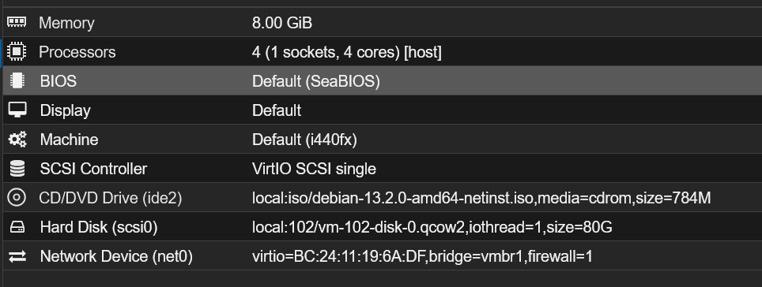

| **Componente**     | **Especificación Mínima** | **Asignación en Proxmox** |
| ------------------ | ------------------------- | ------------------------- |
| **CPU**            | 4 vCores                  | **4 vCores**              |
| **Memoria RAM**    | 8 GB                      | **8 GB**                  |
| **Almacenamiento** | 50 GB                     | **80 GB                   |
| **Red**            | 1 Interfaz                | `vmbr1` (Bridge)          |
# 1. Requisitos de la Máquina Virtual



## 2. Preparación del Sistema Base

```Bash
# 1. Actualización de repositorios y del sistema
sudo apt update && sudo apt upgrade -y

# 2. Instalación de utilidades esenciales
sudo apt install -y curl apt-transport-https unzip wget libcap2-bin software-properties-common lsb-release gnupg2
```

## 3. Instalación Nativa mediante _Wazuh Installation Assistant_

Wazuh proporciona un script oficial que orquesta la instalación de los paquetes `.deb`, la configuración de repositorios y la generación de certificados TLS para la comunicación interna entre los nodos.

### 3.1. Descarga y Ejecución del Asistente

Ejecutaremos el script con el parámetro `-a` (All-in-One) que automatiza todo el flujo.

```Bash
# Descargar el script de instalación
curl -sO [https://packages.wazuh.com/4.8/wazuh-install.sh](https://packages.wazuh.com/4.8/wazuh-install.sh)

# Ejecutar el asistente en modo desatendido (All-In-One)
sudo bash ./wazuh-install.sh -a
```

### 3.2. Captura de Credenciales

Al finalizar la instalación, el script generará unas contraseñas aleatorias para los usuarios administradores. **Es vital copiarlas**. El sistema mostrará algo similar a esto por pantalla:

```Plaintext
INFO: --- Summary ---
INFO: You can access the web interface https://<wazuh-dashboard-ip>
    User: admin
    Password: <ADMIN_PASSWORD>
INFO: Installation finished.
```

## 4. Gestión de Servicios y Verificación (`systemd`)

Como la instalación es nativa, no usamos contenedores. Todos los servicios son gestionados por `systemctl`. A continuación, se detallan los comandos para verificar que la triada de Wazuh funciona correctamente:

|Servicio|Descripción|Comando de Estado|
|---|---|---|
|`wazuh-indexer`|Base de datos analítica|`sudo systemctl status wazuh-indexer`|
|`wazuh-manager`|Motor de recolección y reglas|`sudo systemctl status wazuh-manager`|
|`wazuh-dashboard`|Interfaz gráfica (Web GUI)|`sudo systemctl status wazuh-dashboard`|

**Comprobación del estado de los puertos clave:** Para asegurar que los servicios están escuchando, podemos utilizar `ss` o `netstat`:

```Bash
# Comprobar escucha de agentes (1514) y API (55000)
sudo ss -tulpn | grep -E "1514|55000|443|9200"
```